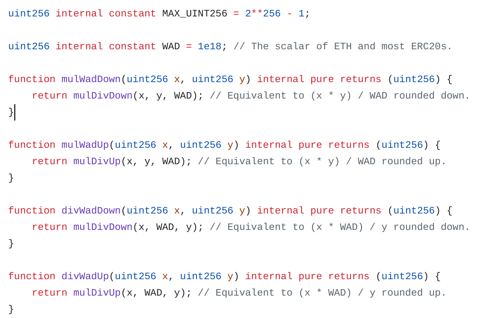

# Fixed-Point Numbers in Solidity - Overview

## What Are Fixed-Point Numbers in Solidity?

In Solidity, fixed-point numbers are intended to represent fractional values by using a scaled integer representation. However, as of Solidity 0.8.x, native fixed-point data types (`fixed` and `ufixed`) are **not yet fully supported**. Developers must manually implement fixed-point arithmetic using integer types (such as `uint256` or `int256`) with a predefined scaling factor.

## Why Use Fixed-Point Numbers?

Fixed-point numbers are useful in blockchain applications where precise decimal arithmetic is required, such as:

- **Finance & DeFi**: Tokens, interest rate calculations, and exchange rates.
- **Gaming**: Representing fractional rewards or game currency values.
- **Mathematical Computations**: Situations requiring non-integer precision without floating-point errors.

Since Solidity does not support floating-point numbers (`float` or `double` like in traditional programming languages), developers must simulate fixed-point behavior using scaled integers.

## Who Uses Fixed-Point Numbers in Solidity?

- **Decentralized Finance (DeFi) developers** use fixed-point math for lending protocols, staking rewards, and automated market makers (AMMs).
- **Smart contract developers** handling currency conversion or any form of fractional values.
- **Gaming and NFT platforms** where fractional ownership or microtransactions are involved.

## Implementing Fixed-Point Arithmetic in Solidity

A common approach is to use a scaling factor/multiplier (e.g., `10^18` for representing values similar to Ethereum’s `wei` system). 

### First example

Here’s an example implementation:

```solidity
// SPDX-License-Identifier: MIT
pragma solidity ^0.8.0;

contract FixedPointExample {
    uint256 constant SCALING_FACTOR = 1e18; // 10^18 scaling factor

    function multiplyFixed(uint256 a, uint256 b) public pure returns (uint256) {
        return (a * b) / SCALING_FACTOR;
    }

    function divideFixed(uint256 a, uint256 b) public pure returns (uint256) {
        require(b != 0, "Division by zero");
        return (a * SCALING_FACTOR) / b;
    }
}
```

### Explanation:

- We use `SCALING_FACTOR = 10^18` to simulate decimal precision.
- Multiplication and division operations adjust for scaling to maintain accuracy.
- This ensures precise calculations while using integer arithmetic.

### Second example

A more complete example can be found on the [Solidity lang page](https://soliditylang.org/blog/2021/09/27/user-defined-value-types/)

The following example illustrates a custom type UFixed representing a decimal fixed point type with 18 decimals and a minimal library to do arithmetic operations on the type.

```solidity
// SPDX-License-Identifier: GPL-3.0
pragma solidity ^0.8.8;

// Represent a 18 decimal, 256 bit wide fixed point type
// using a user defined value type.
type UFixed is uint256;

/// A minimal library to do fixed point operations on UFixed.
library FixedMath {
    uint constant multiplier = 10**18;

    /// Adds two UFixed numbers. Reverts on overflow,
    /// relying on checked arithmetic on uint256.
    function add(UFixed a, UFixed b) internal pure returns (UFixed) {
        return UFixed.wrap(UFixed.unwrap(a) + UFixed.unwrap(b));
    }
    /// Multiplies UFixed and uint256. Reverts on overflow,
    /// relying on checked arithmetic on uint256.
    function mul(UFixed a, uint256 b) internal pure returns (UFixed) {
        return UFixed.wrap(UFixed.unwrap(a) * b);
    }
    /// Take the floor of a UFixed number.
    /// @return the largest integer that does not exceed `a`.
    function floor(UFixed a) internal pure returns (uint256) {
        return UFixed.unwrap(a) / multiplier;
    }
    /// Turns a uint256 into a UFixed of the same value.
    /// Reverts if the integer is too large.
    function toUFixed(uint256 a) internal pure returns (UFixed) {
        return UFixed.wrap(a * multiplier);
    }
}
```


## Library

Several librares are available to use fixed-point number in our application

### Solmate [transmissions11]

> [GitHub](https://github.com/transmissions11/solmate/blob/main/src/utils/FixedPointMathLib.sol)
> Author:  [transmissions11](https://github.com/transmissions11)
>
> Licence: AGPL-3.0-only
> Last update: 


Here the main functions



## Math 64.64 [ABDK]

> [GitHub](https://github.com/abdk-consulting/abdk-libraries-solidity)
> Author: [ABDK Consulting](https://abdk.consulting/)
> Last update: 2023

Library of mathematical functions operating with signed 64.64-bit fixed point numbers.

, which is fast, but it uses binary numbers which are counter-intuitive and non-familiar to humans.

### Fixidity

> [Fixidity](https://github.com/CementDAO/Fixidity)
> Author: CementDAO)
>
> Last update: 2019

h operates with denary numbers and has wide precision, but is slow and susceptible to phantom overflow.

**Overflow**

In addition to fixed-point arithmetic operations, FixidityLib is fully protected against overflow. Any operation that causes an overflow to happen will revert.

**Digits**

The maximum representable integer in 256 bits has 76 digits, and we arbitrarily decided to allocate 24 digits to the decimal part and the other 52 to the integer part. 

https://medium.com/cementdao/fixed-point-math-in-solidity-616f4508c6e8

# PRBMath [PaulRBerg]

> [GitHub](https://github.com/PaulRBerg/prb-math/)
> Author:  PaulRBerg


**Solidity library for advanced fixed-point math** that operates with signed 59.18-decimal fixed-point and unsigned 60.18-decimal fixed-point numbers. 

- The name of the number format comes from the integer part having up to 59 digits for signed numbers and 60 digits for unsigned numbers, while the fractional part has up to 18 decimals
- The numbers are bound by the minimum and the maximum values permitted by the Solidity types int256 and uint256.

This library:

- Operates with signed and unsigned denary fixed-point numbers, with 18 trailing decimals
- Offers advanced math functions like logarithms, exponentials, powers and square roots
- Provides type safety via user-defined value types
- Gas efficient, but still user-friendly
- Ergonomic developer experience thanks to using free functions instead of libraries
- Bakes in overflow-safe multiplication and division via `mulDiv`
- Reverts with custom errors instead of reason strings
- Documented with NatSpec comments
- Built and tested with Foundry

#### Motivation

The author wanted a fixed-point math library that is at the same time intuitive, efficient and safe. 

- [ABDKMath64x64](https://github.com/abdk-consulting/abdk-libraries-solidity) is fast, but it uses binary numbers which are counter-intuitive and non-familiar to humans. 
- [Fixidity](https://github.com/CementDAO/Fixidity) operates with denary numbers and has wide precision, but is slow and susceptible to phantom overflow. 
- [Solmate](https://github.com/transmissions11/solmate), which checks all the boxes mentioned thus far, but it doesn't offer type safety.

### Security

The codebase has undergone audits by leading security experts from Cantina and Certora. For a comprehensive list of all audits conducted, see the [SECURITY](https://github.com/PaulRBerg/prb-math/blob/main/SECURITY.md) file.

### Example

https://github.com/recallnet/contracts/blob/main/src/token/ValidatorRewarder.sol

```solidity
/// @notice Alias for {wrap}.
function ud(uint256 x) pure returns (UD60x18 result) {
    result = UD60x18.wrap(x);
}
```


```solidity
// SPDX-License-Identifier: UNLICENSED
pragma solidity >=0.8.19;

import { UD60x18, ud } from "@prb/math/src/UD60x18.sol";

contract UnsignedConsumer {
  /// @notice Calculates 5% of the given signed number.
  /// @dev Try this with x = 400e18.
  function unsignedPercentage(UD60x18 x) external pure returns (UD60x18 result) {
    UD60x18 fivePercent = ud(0.05e18);
    result = x.mul(fivePercent);
  }

  /// @notice Calculates the binary logarithm of the given signed number.
  /// @dev Try this with x = 128e18.
  function unsignedLog2(UD60x18 x) external pure returns (UD60x18 result) {
    result = x.log2();
  }
}
```


## Security Issues & Considerations

While fixed-point arithmetic provides precision, it introduces security risks:

### 1. **Overflow and Underflow**

Prior to Solidity 0.8, integer overflow and underflow were critical issues. However, in Solidity 0.8+, arithmetic operations now revert on overflow/underflow by default.

### 2. **Precision Loss**

Integer division in Solidity **truncates decimals**, leading to precision loss. Developers must carefully manage scaling factors and rounding.

### 3. **Division by Zero**

Always ensure the denominator is non-zero before performing division.

```
require(b != 0, "Division by zero");
```

### 4. **Gas Costs**

Performing fixed-point arithmetic increases gas costs due to additional multiplication and division operations. Optimizing smart contract logic can help mitigate excessive gas consumption.

## Conclusion

Although Solidity does not yet support native fixed-point types, developers can simulate fixed-point arithmetic using integer scaling techniques. This is essential for applications requiring precision, such as DeFi, gaming, and financial smart contracts. However, careful handling of precision loss, overflow, and gas optimization is necessary to ensure secure and efficient smart contracts.

By following best practices, Solidity developers can effectively implement fixed-point numbers while avoiding common pitfalls.

SOlidity - 

https://github.com/PaulRBerg/prb-math


## Resources

- [Alberto Cuesta Canada - Fixed point math in Solidity](https://medium.com/cementdao/fixed-point-math-in-solidity-616f4508c6e8)
- [What fixed or float point math libraries are available in Solidity?](https://ethereum.stackexchange.com/questions/83785/what-fixed-or-float-point-math-libraries-are-available-in-solidity)
- https://medium.com/coinmonks/math-in-solidity-part-1-numbers-384c8377f26d
- [https://coinsbench.com/decimals-in-solidity-a-fixed-point-of-view-df1a8704cf04](https://coinsbench.com/decimals-in-solidity-a-fixed-point-of-view-df1a8704cf04)
