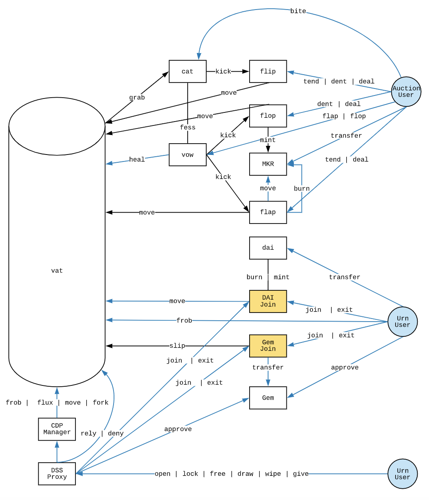
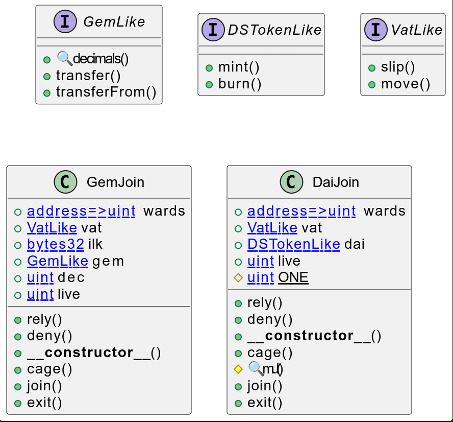
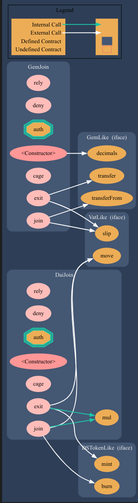

# MakerDAO - Join contract 

https://docs.makerdao.com/smart-contract-modules/collateral-module/join-detailed-documentation

https://docs.makerdao.com/smart-contract-modules/collateral-module/join-detailed-documentation

# Join - Detailed Documentation

- **Contract Name:** join.sol
- **Type/Category:** DSS —> Token Adapter Module
- [**Associated MCD System Diagram**](https://github.com/makerdao/dss/wiki)
- [**Contract Source**](https://github.com/makerdao/dss/blob/master/src/join.sol)
- **Etherscan**
  - [**Join Dai** ](https://etherscan.io/address/0x9759a6ac90977b93b58547b4a71c78317f391a28)
  - [**Join Eth**](https://etherscan.io/address/0x2f0b23f53734252bda2277357e97e1517d6b042a)
  - [**Join Bat**](https://etherscan.io/address/0x3d0b1912b66114d4096f48a8cee3a56c231772ca)


## 1. Introduction (Summary)

Join consists of three smart contracts: `GemJoin`, `ETHJoin`, and `DaiJoin:`  

- `GemJoin` - allows standard ERC20 tokens to be deposited for use with the system. 
- `ETHJoin` - allows native Ether to be used with the system. 
-  `DaiJoin` - allows users to withdraw their Dai from the system into a standard ERC20 token.

Each `join` contract is created specifically to allow the given token type to be `join`'ed to the `vat`. Because of this, each `join` contract has slightly different logic to account for the different types of tokens within the system.

From [makerDAO gitbook](https://docs.makerdao.com/~gitbook/image?url=https%3A%2F%2F4167714931-files.gitbook.io%2F~%2Ffiles%2Fv0%2Fb%2Fgitbook-legacy-files%2Fo%2Fassets%252F-LtJ1VeNJVW-jiKH0xoL%252F-Ltujg5X9qqf1c2Hxg0p%252F-LtukKf_L_uSQRgi_Op7%252FScreen%2520Shot%25202019-11-17%2520at%25202.05.06%2520PM.png%3Falt%3Dmedia%26token%3D67232a36-9f87-4911-bf1a-bf029decdf68&width=768&dpr=4&quality=100&sign=f4268595&sv=2)

Join Interactions with the Maker Protocol




## Details

### Interface

The contract defined several different interface

- GemLike with three ERC-20 standard function: decimals, transfer and transferFrom

- DSTokenLike with mint and burn
- VatLike with two functions slip and move
  - move:  transfer stablecoin between users.
  - slip: modify a user's collateral balance.
  - See https://docs.makerdao.com/smart-contract-modules/core-module/vat-detailed-documentation


```solidity
interface GemLike { 
    function decimals() external view returns (uint);
    function transfer(address,uint) external returns (bool);
    function transferFrom(address,address,uint) external returns (bool);
}

interface DSTokenLike {
    function mint(address,uint) external;
    function burn(address,uint) external;
}

interface VatLike {
    function slip(bytes32,address,int) external;
    function move(address,address,uint) external;
}
```


### Cage

Cage is used to put in pause the system by putting the flag `live`from 1 to zero.

```solidity
function cage() external auth {
	live = 0;
	emit Cage();
}
```

You can not `exit`the system if the function `cage`has been called


### UML





### Graph





### Surya Contracts Description Table


|  Contract  |         Type        |       Bases      |                  |                 |
|:----------:|:-------------------:|:----------------:|:----------------:|:---------------:|
|     └      |  **Function Name**  |  **Visibility**  |  **Mutability**  |  **Modifiers**  |
||||||
| **GemLike** | Interface |  |||
| └ | decimals | External ❗️ |   |NO❗️ |
| └ | transfer | External ❗️ | 🛑  |NO❗️ |
| └ | transferFrom | External ❗️ | 🛑  |NO❗️ |
||||||
| **DSTokenLike** | Interface |  |||
| └ | mint | External ❗️ | 🛑  |NO❗️ |
| └ | burn | External ❗️ | 🛑  |NO❗️ |
||||||
| **VatLike** | Interface |  |||
| └ | slip | External ❗️ | 🛑  |NO❗️ |
| └ | move | External ❗️ | 🛑  |NO❗️ |
||||||
| **GemJoin** | Implementation |  |||
| └ | rely | External ❗️ | 🛑  | auth |
| └ | deny | External ❗️ | 🛑  | auth |
| └ | <Constructor> | Public ❗️ | 🛑  |NO❗️ |
| └ | cage | External ❗️ | 🛑  | auth |
| └ | join | External ❗️ | 🛑  |NO❗️ |
| └ | exit | External ❗️ | 🛑  |NO❗️ |
||||||
| **DaiJoin** | Implementation |  |||
| └ | rely | External ❗️ | 🛑  | auth |
| └ | deny | External ❗️ | 🛑  | auth |
| └ | <Constructor> | Public ❗️ | 🛑  |NO❗️ |
| └ | cage | External ❗️ | 🛑  | auth |
| └ | mul | Internal 🔒 |   | |
| └ | join | External ❗️ | 🛑  |NO❗️ |
| └ | exit | External ❗️ | 🛑  |NO❗️ |


 Legend

|  Symbol  |  Meaning  |
|:--------:|-----------|
|    🛑    | Function can modify state |
|    💵    | Function is payable |


## 2. Contract Details:

### Glossary (Join)

- `vat` - storage of the `Vat`’s address.
- `ilk` - id of the Ilk for which a `GemJoin` is created for.
- `gem` - the address of the `ilk` for transferring.
- `dai` - the address of the `dai` token.
- `one` - a 10^27 uint used for math in `DaiJoin`.
- `live` - an access flag for the `join` adapter.
- `dec` - decimals for the Gem.

Every `join` contract has 4 public functions: a constructor, `join`, `exit`, and `cage`. 

- The constructor is used on contract initialization and sets the core variables of that `join` contract.
-  `Join` and `exit` are both true to their names. 
  - `Join` provides a mechanism for users to add the given token type to the `vat`. It has slightly different logic in each variation, but generally resolves down to a `transfer` and a function call in the `vat`.
  -  `Exit` is very similar, but instead allows the the user to remove their desired token from the `vat`. 
- `Cage` allows the adapter to be drained (allows tokens to move out but not in).

## 3. Key Mechanisms & Concepts

### GemJoin

The `GemJoin` contract serves a very specified and singular purpose which is relatively abstracted away from the rest of the core smart contract system. When a user desires to enter the system and interact with the `dss` contracts, they must use one of the `join` contracts. 

After they have finished with the `dss` contracts, they must call `exit` to leave the system and take out their tokens. 

When the `GemJoin` gets `cage`d by an `auth`ed address, it can `exit` collateral from the Vat but it can no longer `join` new collateral.

User balances for collateral tokens added to the system via `join` are accounted for in the `Vat` as `Gem` according to collateral type `Ilk` until they are converted into locked collateral tokens (`ink`) so the user can draw Dai.

### DaiJoin

The `DaiJoin` contract serves a similar purpose. It manages the exchange of Dai that is tracked in the `Vat` and ERC-20 Dai that is tracked by `Dai.sol`. After a user draws Dai against their collateral, they will have a balance in `Vat.dai`. 

This Dai balance can be `exit`' ed from the Vat using the `DaiJoin` contract which holds the balance of `Vat.dai` and mint's ERC-20 Dai. 

When a user wants to move their Dai back into the `Vat` accounting system (to pay back debt, participate in auctions, pack `bag`'s in the `End`, or utilize the DSR, etc), they must call `DaiJoin.join`. 

By calling `DaiJoin.join` this effectively `burn`'s the ERC-20 Dai and transfers `Vat.dai` from the `DaiJoin`'s balance to the User's account in the `Vat`. 

Under normal operation of the system, the `Dai.totalSupply` should equal the `Vat.dai(DaiJoin)` balance.

 When the `DaiJoin` contract gets `cage`'d by an `auth`'ed address, it can move Dai back into the Vat but it can no longer `exit` Dai from the Vat.

## 4. Gotchas (Potential source of user error)

The main source of user error with the `Join` contract is that Users should never `transfer` tokens directly to the contracts, they **must** use the `join` functions or they will not be able to retrieve their tokens.

There are limited sources of user error in the `join` contract system due to the limited functionality of the system. Barring a contract bug, should a user call `join` by accident they could always get their tokens back through the corresponding `exit` call on the given `join` contract.

The main issue to be aware of here would be a well-executed phishing attack. As the system evolves and potentially more `join` contracts are created, or more user interfaces are made, there is the potential for a user to have their funds stolen by a malicious `join` contract which does not actually send tokens to the `vat`, but instead to some other contract or wallet.

## 5. Failure Modes (Bounds on Operating Conditions & External Risk Factors)

**There could potentially be a** `**vat**` **upgrade that would require new** `**join**` **contracts to be created.**

If a `gem` contract were to go through a token upgrade or have the tokens frozen while a user's collateral was in the system, there could potentially be a scenario in which the users were unable to redeem their collateral after the freeze or upgrade was finished. This scenario likely presents little risk though because the token going through this upgrade would more than likely want to work alongside the Maker community to be sure this was not an issue.

## Example

