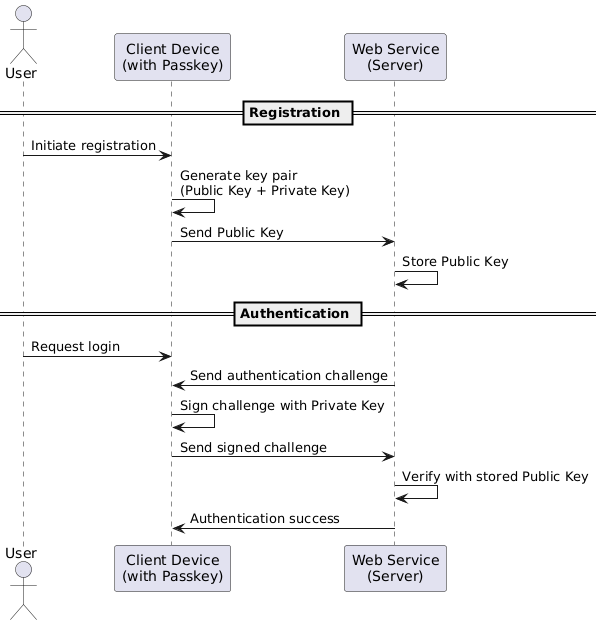

# **Passkeys: The Future of Authentication — Security Benefits and Risks**

In the evolving landscape of digital security, **passkeys** are emerging as a promising alternative to traditional passwords. Developed under the **FIDO2** standard and supported by tech giants like Apple, Google, and Microsoft, passkeys aim to eliminate phishing, password reuse, and credential stuffing — problems that plague traditional authentication systems.

Video

------

## **What Are Passkeys?**

A **passkey** is a cryptographic credential, typically composed of a **key pair**: 

- a **public key**, which is stored on the server, 
- and a **private key**, which stays securely on the user's device. 

Passkeys are tied to biometric authentication (like Face ID, Touch ID, or Windows Hello) or device PINs, making them highly user-friendly and secure.

They use **WebAuthn**, a standard API that enables public-key-based authentication on the web.

### What is WebAuthn ?


The Web Authentication API (also known as WebAuthn) is a [specification](https://w3c.github.io/webauthn/) written by the [W3C](https://www.w3.org/) and [FIDO](https://fidoalliance.org/), with the participation of Google, Mozilla, Microsoft, Yubico, and others. The API allows servers to register and authenticate users using public key cryptography instead of a password.

https://webauthn.guide


------

## **How Do Passkeys Work?**

1. **Registration**:
   - User registers on a site or app.
   - A new public-private key pair is generated.
   - The **public key** is sent to the server and stored.
   - The **private key** stays on the device, protected by the device’s secure enclave or TPM (Trusted Platform Module).
2. **Authentication**:
   - The server sends a **challenge** to the client.
   - The client signs it with the private key after biometric/PIN verification.
   - The server verifies the signature using the public key.

No secrets are transmitted or stored server-side, significantly reducing attack surfaces



------

Other schema:  https://youtu.be/wqobiN4KJGo?feature=shared&t=2088

## Challenge

Passkeys are synced within ecosystems but not always across them. For instance, a passkey created on an iPhone is stored in iCloud and also available on the user’s Mac and iPad. However, signing in on a Windows PC requires using the phone to authenticate — because Windows doesn’t sync passkeys with iCloud or vice versa.

After authenticating with a phone, the system may ask if you'd like to create a new passkey on your Windows machine.

 The result? Now the user has a second passkey — one on iCloud, one on Windows. Sign in on another Windows device, and now there’s a third. Since Windows doesn’t sync passkeys across devices (yet), multiple passkeys accumulate.

This can get confusing. Users might not remember where they’ve created passkeys, or which ones are still valid. The speaker emphasized the need for *passkey management*, similar to session management in apps like Gmail — users should be able to audit and revoke credentials.

Example: if you saved a passkey on your partner’s laptop and later break up, you probably don’t want them accessing your bank account. But today, there are few good tools to manage this kind of scenario.


## The Code Behind Passkeys

So how complex is it to implement all this? Turns out, not very.

### Create a passkey

To *create* a passkey, a server would begin creating a new credential by calling `navigator.credentials.create()` on the client with some basic `publicKeyCredentialCreationOptions`. 

```javascript
const credential = await navigator.credentials.create({
    publicKey: publicKeyCredentialCreationOptions
});
```


The `publicKeyCredentialCreationOptions` object contains a number of required and optional fields that a server specifies to create a new credential for a user.

| **Field**                  | **Description**                                              |
| -------------------------- | ------------------------------------------------------------ |
| **challenge**              | The challenge is a buffer of cryptographically random bytes generated on the server, and is needed to prevent "replay attacks". Read the spec. |
| **rp**                     | This stands for “relying party”; it can be considered as describing the organization responsible for registering and authenticating the user. The id must be a subset of the domain currently in the browser. For example, a valid id for this page is webauthn.guide. Read the spec. |
| **user**                   | This is information about the user currently registering. The authenticator uses the id to associate a credential with the user. It is suggested to not use personally identifying information as the id, as it may be stored in an authenticator. Read the spec. |
| **pubKeyCredParams**       | This is an array of objects describing what public key types are acceptable to a server. The alg is a number described in the COSE registry; for example, -7 indicates that the server accepts Elliptic Curve public keys using a SHA-256 signature algorithm. Read the spec. |
| **authenticatorSelection** | This optional object helps relying parties make further restrictions on the type of authenticators allowed for registration. In this example, we are indicating we want to register a cross-platform authenticator (like a Yubikey) instead of a platform authenticator like Windows Hello or Touch ID. Read the spec. |
| **timeout**                | The time (in milliseconds) that the user has to respond to a prompt for registration before an error is returned. Read the spec. |
| **attestation**            | The attestation data that is returned from the authenticator has information that could be used to track users. This option allows servers to indicate how important the attestation data is to this registration event. A value of "none" indicates that the server does not care about attestation. A value of "indirect" means that the server will allow for anonymized attestation data. "Direct" means that the server wishes to receive the attestation data from the authenticator. Read the spec. |

You set parameters like the site name and URL — critically important, since passkeys are *bound to web origins* to prevent phishing. 

Unlike passwords, which users can copy or paste into the wrong field, passkeys can’t be shared between “microsoft.com” and “micr0soft.com.” If the origin doesn’t match, the system refuses to use the passkey.

#### Example:

```javascript
let credential = await navigator.credentials.create({
  publicKey: {
    challenge: new Uint8Array([117, 61, 252, 231, 191, 241 /* … */]),
    rp: { id: "acme.com", name: "ACME Corporation" },
    user: {
      id: new Uint8Array([79, 252, 83, 72, 214, 7, 89, 26]),
      name: "jamiedoe",
      displayName: "Jamie Doe",
    },
    pubKeyCredParams: [{ type: "public-key", alg: -7 }],
  },
});
```


### Sign-in

For *sign-in*, developers call `navigator.credentials.get()` and include parameters like a cryptographic challenge. The system presents available passkeys to the user, and upon confirmation, the signed challenge is returned to the server for validation.

On the client side, it’s just a few lines of JavaScript. 

On the server side, parsing, signature validation, and credential storage are required. Developers can choose from open-source or commercial FIDO servers to handle that.


**Note:** The "challenge" must be a buffer of random information at least 16 bytes in size.


https://developer.mozilla.org/en-US/docs/Web/API/Web_Authentication_API


## **Security Benefits**

### Resistance to Phishing

Passkeys are **origin-bound**, meaning they won’t work on lookalike or malicious websites. This mitigates phishing attacks effectively.

### No Shared Secrets

Unlike passwords, passkeys are never reused or exposed in transit or at rest on servers. Even if the server is compromised, the attacker gets only the public key.

### Multi-Device Support with Syncing

Platforms like iCloud Keychain and Google Password Manager allow passkeys to sync securely across devices using end-to-end encryption.

### User Experience

Logging in with a passkey can be faster and more seamless than typing a password — a single biometric scan is enough.

------

## **Security Risks and Challenges**

### Device Lock-in

Passkeys are stored on user devices. If users lose access and haven't synced or backed them up (e.g., via iCloud or Google Account), they may be locked out.

### Cloud Sync Risks

While passkey syncing is encrypted, if an attacker gains access to the cloud account (e.g., via SIM swap or account recovery exploit), they could potentially access the synced keys.

### Adoption Lag

While major platforms support passkeys, adoption across all websites and services is slow. Many still require passwords, leading to hybrid environments that reintroduce vulnerabilities.

### Advanced Threats

A compromised device (via malware or root/jailbreak) could potentially access the private key or override biometric prompts. Endpoint security remains vital.

------

## **Real-World Examples**

### **Apple Ecosystem**

Apple introduced passkeys in iOS 16 and macOS Ventura. Users can sign into supported websites like Best Buy or eBay using Face ID or Touch ID. Passkeys are synced via iCloud Keychain with end-to-end encryption.

### **Google Accounts**

Google allows users to sign in using passkeys stored in their Google Password Manager. Passkeys work across devices if sync is enabled and users are signed in to the same Google account.

### **PayPal**

PayPal has enabled passkey support for accounts in the U.S., offering login via biometric scan instead of passwords — a significant usability and security upgrade.

------

## **Conclusion**

**Passkeys represent a transformative step forward** in authentication — offering strong protection against phishing, credential theft, and user friction. However, as with any new tech, they come with transitional challenges and implementation risks.

Organizations should:

- Encourage users to adopt passkeys.
- Provide fallback options securely.
- Harden endpoint devices and cloud accounts.

As support grows, passkeys could help move the web toward a truly **passwordless future** — one that’s more secure and user-friendly.

Write me a technical article about passkey, talk about the security and risk Give some example

Terms

A passkey provider is responsible for the creation and management of a user’s passkeys. A passkey provider can be a browser or operating system vendor where passkeys are stored and synced within the built in credential manager (such as iCloud keychain or Google password manager), or a third party provider where passkeys are stored and synced within a third party app or browser extension (such as 1Password or Dashlane).

https://fidoalliance.org/passkeys/

HOW DOES A PASSKEY BECOME AVAILABLE ACROSS A USER’S DEVICES?

When a user creates a passkey on any of their devices, it gets synced to all the user’s other devices using the same passkey provider that is also signed into the same user’s account. Thus, passkeys created on one device become available on all devices.

Notably, if the user gets a new device and sets it up with their passkey provider, the user’s passkeys are synced and available for sign-in on the new device.

## Google

Do I have to set up a passkey on all my devices individually? Will there be separate passkeys on my phone and laptop?


If Google detects that you don’t have a passkey on a device yet, we’ll prompt you to create one. You’ll need one passkey per device, unless the device has some mechanism to “synchronize” passkeys to other devices already, like with Apple iCloud. In this case only a single passkey for all your iCloud devices is required.

What is the account recovery process if I’m locked out and don’t have my phone, say it’s lost or broken and I can’t verify my identity?


You can always fall back to legacy authentication options such as passwords and traditional 2-step-verification. In a case where you can no longer remember your password, you can also go through Google’s Account recovery flow. We encourage you to add your email and phone number to ensure you can always access your account.

https://safety.google/authentication/passkey/

## Reference:

https://webauthn.guide

https://www.youtube.com/watch?v=knrEje81f68

https://fidoalliance.org/passkeys/