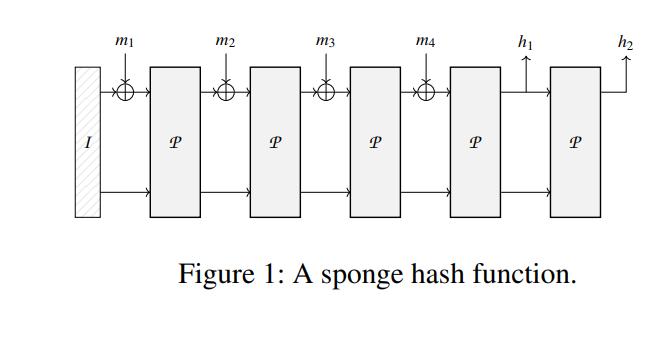

## Poseidon Hash Function: A Technical Overview

### Introduction

The Poseidon hash function is a cryptographic hash function specifically designed for use in **zero-knowledge proof systems** like SNARKs and STARKs. Unlike general-purpose hashes like SHA-2 or SHA-3, Poseidon is optimized for **efficient arithmetic circuits**, particularly over finite fields, which makes it highly suitable for zk-SNARK-friendly applications.

The posidion hash function is defined in this paper [POSEIDON: A New Hash Function for Zero-Knowledge Proof Systems (Updated Version)](https://eprint.iacr.org/2019/458.pdf) with the following author:  Lorenzo Grassi, Dmitry Khovratovich, Christian Rechberger, Arnab Roy, and Markus Schofnegger.

### Key Design Goals

- **ZK-friendliness**: Efficient inside arithmetic circuits (low R1CS/constraint cost).
- **Security**: Cryptographically strong against preimage, collision, and other standard attacks.
- **Flexibility**: Parameterizable for different field sizes, security levels, and performance needs.

------

### Structure of Poseidon

Poseidon is a **sponge construction**, composed of a **permutation-based design** with rounds that alternate between:

1. **Non-linear (S-box) layer**
2. **Linear layer (MDS matrix multiplication)**
3. **Addition of round constants**

#### Permutation Function

The permutation is the core of Poseidon. It consists of:

- **Full rounds**: Each state element goes through a nonlinear transformation.
- **Partial rounds**: Only one element gets the nonlinear transformation to reduce computational cost.

------

### Core Components

#### 1. **S-box Layer (Non-linear)**

The S-box is typically a power function like:
$$
x↦x^5
$$
THis S-Box is suitable for the most popular prime fields in ZK applications,concretely the prime subfields of the scalar field of the BLS12-381 and BN254

or more generally:
$$
x↦x^α
$$
where:

where α ≥ 3 is the smallest positive integer that satisfies gcd(α, p − 1) = 1

α∈Z+, 

This step provides **non-linearity**, crucial for security.

------

#### 2. **MDS Matrix (Linear Mixing)**

A Maximum Distance Separable (MDS) matrix is used to mix the state elements linearly. If:
$$
M=MDS ~matrix,s=state~ vector
$$
Then the mixing is performed as:
$$
s_new=M⋅s
$$
This ensures **diffusion**, so a change in one input affects all outputs.

##### Avoiding Insecure Matrices

According to the [official paper](https://eprint.iacr.org/2019/458.pdf), page 6:  not every MDS matrix provides the same level of security. . In particular, the matrix M must prevent the possibility to set up:

- invariant (or iterative) subspace trails (or equivalently, truncated differentials) with  prob. 1 with inactive S-boxes over more than t − 1 rounds8 (more details are given in the following)
- invariant (or iterative) subspace trails with prob. 1 and with active S-boxes for any number of rounds.

------

#### 3. **Round Constants**

Each round adds precomputed constants to break symmetry and resist attacks:
$$
s_{new}=s+c
$$
Where `c` is a vector of constants for that round.

------

### Parameterization

Poseidon allows tuning the following parameters:

- State size:
  $$
  t∈Z^+
  $$
  
- Number of full rounds:
  $$
  Rf∈Z^+
  $$
  
- Number of partial rounds:
  $$
  Rp∈Z^+
  $$
  
- S-box exponent:
  $$
  α∈{3,5,7,…}
  $$
  
- Finite field:

  Fp, where p is primee

------

### Applications

- Zero-Knowledge Proof Systems (SNARKs, STARKs)
- Merkle trees in zkApps
- Commitments in blockchain smart contracts

We suggest POSEIDON for all applications of zero-knowledgefriendly hashing, concretely: 

• Using POSEIDON for commitments in various protocols, where the knowledge of the committed value is proven in zero knowledge: For this we suggest a singlecall permutation-based hashing with POSEIDON-128 and widths from 2 to 5 field elements. The advantage over the Pedersen hash, for example, is that POSEIDON is faster and can also be used in signature schemes which allows for a smaller code footprint. 

- Hashing multi-element objects with certain fields encoded as field elements, so that statements about these fields are proven in zero knowledge: We suggest variablelength sponge-based hashing with POSEIDON-128 or POSEIDON-80 with width 5 (and rate 4). 
- Using POSEIDON in Merkle trees to enable zeroknowledge proofs of knowledge of a leaf in the tree with optional statements about the leaf content: We recommend Merkle trees of arity 4 (i.e., width 5) with POSEIDON-128 as the most performant, but trees of more conventional arities can be used as well. 
- Verifiable encryption with POSEIDON within Integrated Encryption Scheme : Put POSEIDON inside the DuplexSponge authenticated encryption framework and initialize it with a session key based on the recipient’s public key. Then one can prove that the recipient can decrypt the ciphertext into a plaintext with certain properties.

 There exist several third-party protocols that already use POSEIDON in these use cases: 

- [Filecoin](https://github.com/filecoin-project/neptune) employs POSEIDON for Merkle tree proofs with different arities and for two-value commitments.
- [Dusk Network](https://github.com/dusk-network/Poseidon252) uses POSEIDON to build a Zcash-like protocol for securities trading.It also uses POSEIDON for encryption as described above. 
- Sovrin uses POSEIDON for Merkle-tree based revocation
- Loopring uses POSEIDON for private trading on Ethereum

## Select the right use Poseido

## Poseidon in Your Application

In order to determine the right version of Poseidon for your scenario, you need to know the following:

- The *field* F, over which the arithmetic statements that use Poseidon are defined. It is often determined by the ZK proof system.  Most likely, it is a prime-order subgroup of the group of points of an elliptic curve,  where the curve is BLS12-381, BN254, or Ed25519.  Poseidon maps sequences of F elements to a fixed length sequence of F elements.
- You hash messages of *arbitrary* length or *fixed* length (like in a Merkle tree, where almost always 2 elements are hashed).
- The *security level*  M against collision and preimage attacks (most  likely, 128 bits).

With this information, you determine the *width w,* measured in the number of F elements, of Poseidon permutation as follows:

- Reserve c elements for capacity so that c elements of F contain 2M or more bits.
- If messages have fixed length l which is reasonably small (10 or less), then set w = c+l.

Then you figure out which S-box is compatible with the curve.  For the curves BLS12-381, BN254, or Ed25519 the S-box x^5 is optimal.

From https://www.poseidon-hash.info

## DIfferense with pedersen hash

According to the paper,  POSEIDON uses up to 8x fewer constraints per message bit than Pedersen Hash.

------

### Security

Poseidon provides strong resistance to:

- **Collision attacks**
- **Preimage and second preimage attacks**
- **Differential and linear cryptanalysis**
- **Algebraic and Gröbner basis attacks**

https://autoparallel.github.io/poseidon/index.html

Poseidon - plonk: https://drive.google.com/file/d/1bZZvKMQHaZGA4L9eZhupQLyGINkkFG_b/view

Hades design ? https://dl.acm.org/doi/10.1007/978-3-030-77886-6_2

https://www.usenix.org/system/files/sec21-grassi.pdf

https://www.zellic.io/blog/algebraic-attacks-on-zk-hash-functions/