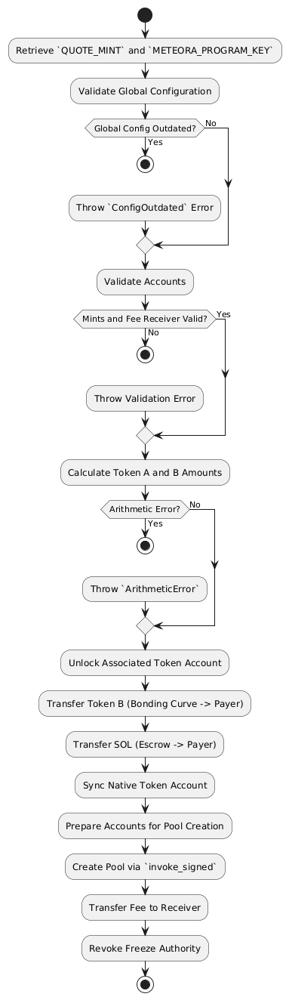

# Pump Science

This article presents the liquidation function from the `Dyad Stablecoin`.

This analyse has been done for the [Code4Arena](https://github.com/code-423n4/2025-01-pump-science/) contest..

Since I have a limited time, I found that it could be interesting to focus only in one function in the `VaultManagerV2`, [liquidate](https://github.com/code-423n4/2024-04-dyad/blob/main/src/core/VaultManagerV2.sol#L205) instead of the whole code.

Prior to the contest, the code has also been audited by [Pashow Audit Group](https://github.com/code-423n4/2025-01-pump-science/blob/main/audits/PumpScience%20-%20Pashov%20audit.pdf)

Pump Science Bonding Curve Protocol is a Solana protocol implementing an advanced bonding curve mechanism for fundraising and sustainable project funding. This protocol enables compound submitters to launch their own token ($DRUG) with dynamic fee structures and automated liquidity management.

[TOC]


## Administrative Roles

### Curve Creator

- Can initialize new bonding curves
- Sets initial parameters and optional whitelist
- Configures launch timing and initial purchases

### Admin

- Can modify protocol parameters
- Manages fee settings
- Controls whitelist status

### Fee Recipients

- Protocol Multisig (`3bM4hewuZFZgNXvLWwaktXMa8YHgxsnnhaRfzxJV944P`)
  - Receives trading fees
  - Has authority over locked LP tokens
  - Receives swapped USDC from liquidity migrations

## Create a Bonding Curve

To create a new bonding curve:

1. Initialize curve parameters
2. Optional: Enable whitelist
3. Set launch timing
4. Configure initial purchases

Trading is enabled along the bonding curve until 85 SOL are raised and all 793,100,000 tokens are sold.

### Functions

#### Validate

```rust
    pub fn validate(&self, params: &CreateBondingCurveParams) -> Result<()> {
        let clock = Clock::get()?;
        // validate start time
        if let Some(start_slot) = params.start_slot {
            require!(
                start_slot >= clock.slot && start_slot <= clock.slot + MAX_START_SLOT_DELAY,
                ContractError::InvalidStartTime
            )
        }

        // validate whitelist
        if self.global.whitelist_enabled {
            let whitelist = self.whitelist.as_ref();
            require!(whitelist.is_some(), ContractError::NotWhiteList);
            require!(
                whitelist.unwrap().creator == self.creator.key(),
                ContractError::NotWhiteList
            );
        }

        require!(
            !self.global.is_config_outdated()?,
            ContractError::ConfigOutdated
        );

        Ok(())
    }
```


##### **Function Overview**

The `validate` function is a precondition check for creating a bonding curve. It ensures that input parameters and relevant accounts meet specific criteria before proceeding with the operation.

The key validations performed are:

1. **Start Time Validation**:
   - Ensures the `params.start_slot` is not in the past and is within a defined delay range (`MAX_START_SLOT_DELAY`).
2. **Whitelist Validation**:
   - If whitelisting is enabled (`global.whitelist_enabled`)
     - Ensures a whitelist exists (`self.whitelist.is_some()`).
     - Ensures the `creator` account matches the whitelist's `creator` field.
3. **Global Configuration Validation**:
   - Verifies that the global configuration is not outdated by calling `self.global.is_config_outdated()`.

If all validations pass, the function returns `Ok(())`. Otherwise, it returns an error.


#### Handler

##### **Function Overview**

The `handler` function is responsible for creating and initializing a bonding curve, including minting tokens, setting up metadata, and performing related operations.

------

###### **Main Steps**

1. **Update Bonding Curve from Parameters**:
   - Updates the bonding curve account using the provided parameters, linking the mint, creator, and global accounts.
   - Uses the current Solana clock for time-dependent values and the bump seed for PDA initialization.
2. **Create Token Metadata**:
   - Calls `intialize_meta` to create token metadata on the associated token account using the provided parameters (`name`, `symbol`, `uri`).
3. **Mint Tokens**:
   - Mints the bonding curve's total supply of tokens to its token account using the bonding curve PDA as the mint authority.
4. **Revoke Mint Authority and Lock ATA**:
   - Revokes the mint authority from the bonding curve account to prevent further token minting.
   - Locks the bonding curve token account to ensure secure state management.
5. **Invariant Validation**:
   - Ensures the bonding curve satisfies protocol-specific invariants to maintain correctness and consistency.
6. **Emit Create Event**:
   - Emits an event (`CreateEvent`) with bonding curve details for external tracking and logging.
7. **Log Success**:
   - Logs a success message and returns `Ok(())`.


##### Code

###### Code4Arena

https://github.com/code-423n4/2025-01-pump-science/blob/ebfd2c6a91c443c75b9bdd08c25ab64714ed9c9f/programs/pump-science/src/instructions/curve/create_bonding_curve.rs#L131

```rust
 pub fn handler(
        ctx: Context<CreateBondingCurve>,
        params: CreateBondingCurveParams,
    ) -> Result<()> {
        let clock = Clock::get()?;
        ctx.accounts.bonding_curve.update_from_params(
            ctx.accounts.mint.key(),
            ctx.accounts.creator.key(),
            &ctx.accounts.global,
            &params,
            &clock,
            ctx.bumps.bonding_curve,
        );
        msg!("CreateBondingCurve::update_from_params: created bonding_curve");

        let mint_k = ctx.accounts.mint.key();
        let mint_authority_signer = BondingCurve::get_signer(&ctx.bumps.bonding_curve, &mint_k);
        let mint_auth_signer_seeds = &[&mint_authority_signer[..]];
        let mint_authority_info = ctx.accounts.bonding_curve.to_account_info();
        let mint_info = ctx.accounts.mint.to_account_info();

        // Create Token Metadata
        ctx.accounts
            .intialize_meta(mint_auth_signer_seeds, &params)?;

        // Mint Tokens
        mint_to(
            CpiContext::new_with_signer(
                ctx.accounts.token_program.to_account_info(),
                MintTo {
                    authority: mint_authority_info.clone(),
                    to: ctx.accounts.bonding_curve_token_account.to_account_info(),
                    mint: mint_info.clone(),
                },
                mint_auth_signer_seeds,
            ),
            ctx.accounts.bonding_curve.token_total_supply,
        )?;

        let locker = &mut ctx
            .accounts
            .into_bonding_curve_locker_ctx(ctx.bumps.bonding_curve);
        
        // Revoke mint authority
        locker.revoke_mint_authority()?;
        locker.lock_ata()?;

        BondingCurve::invariant(locker)?;
        let bonding_curve = ctx.accounts.bonding_curve.as_mut();
        emit_cpi!(CreateEvent {
            name: params.name,
            symbol: params.symbol,
            uri: params.uri,
            mint: *ctx.accounts.mint.to_account_info().key,
            creator: *ctx.accounts.creator.to_account_info().key,
            virtual_sol_reserves: bonding_curve.virtual_sol_reserves,
            virtual_token_reserves: bonding_curve.virtual_token_reserves,
            token_total_supply: bonding_curve.token_total_supply,
            real_sol_reserves: bonding_curve.real_sol_reserves,
            real_token_reserves: bonding_curve.real_token_reserves,
            start_slot: bonding_curve.start_slot,
        });
        msg!("CreateBondingCurve::handler: success");
        Ok(())
    }
```

###### Before Pashow Audit group

Partial code snippet

```rust
// In create_bonding_curve.rs
pub fn handler(
	ctx:Context<CreateBondingCurve>,
	params:CreateBondingCurveParams
) -> Result<(
// real_sol_reserves initialized to 0
ctx.accounts.bonding_curve.update_from_params(...);
// Invariant check will fail if escrow has SOL
BondingCurve::invariant(locker)?;
}
// In curve.rs
pub fn invariant<'info>(ctx: &mut BondingCurveLockerCtx<'info>) -> Result<()> {
if sol_escrow_lamports != bonding_curve.real_sol_reserves {
return Err(ContractError::BondingCurveInvariant.into());
}
}
```


#### Initialize meta

##### **Function Overview**

The `initialize_meta` function creates the metadata account for a bonding curve token using the `CreateMetadataAccountsV3` instruction. It integrates metadata details like the token's name, symbol, and URI into the Solana Token Metadata Program.

------

##### **Main Steps**

1. **Prepare Metadata Information**:

   - Constructs a `DataV2`

      object containing the token's metadata:

     - **Name, Symbol, URI**: Defined in `params`.
     - **Seller Fee**: Set to `0`.
     - **Optional Fields**: (`creators`, `collection`, `uses`) are set to `None`.

2. **Create Metadata Context**:

   - Creates a `CpiContext`object to invoke the Token Metadata Program's `CreateMetadataAccountsV3`

      instruction. This includes:

     - Accounts:
       - `payer`: The account paying for the metadata account creation (usually the creator).
       - `mint`: The associated mint account.
       - `metadata`: The metadata account being created.
       - `update_authority` and `mint_authority`: Both set to the bonding curve account.
       - `system_program` and `rent`: Required Solana program accounts for account creation and rent exemption.
     - **Signers**: Uses `mint_auth_signer_seeds` for PDAs.

3. **Invoke Metadata Creation**:

   - Calls `create_metadata_accounts_v3` with the prepared context and metadata.

4. **Log Completion**:

   - Logs a message confirming successful metadata initialization.

### Accounts

```rust
pub struct CreateBondingCurve<'info> {
    #[account(
        init,
        payer = creator,
        mint::decimals = global.mint_decimals,
        mint::authority = bonding_curve,
        mint::freeze_authority = bonding_curve,
    )]
    mint: Box<Account<'info, Mint>>,

    #[account(mut)]
    creator: Signer<'info>,

    #[account(
        init,
        payer = creator,
        seeds = [BondingCurve::SEED_PREFIX.as_bytes(), mint.key().as_ref()],
        bump,
        space = 8 + BondingCurve::INIT_SPACE,
    )]
    bonding_curve: Box<Account<'info, BondingCurve>>,

    #[account(
        init_if_needed,
        payer = creator,
        associated_token::mint = mint,
        associated_token::authority = bonding_curve,
    )]
    bonding_curve_token_account: Box<Account<'info, TokenAccount>>,
    #[account(
        seeds = [BondingCurve::SOL_ESCROW_SEED_PREFIX.as_bytes(), mint.key().as_ref()],
        bump,
    )]
    /// CHECK: PDA to hold SOL for bonding curve
    pub bonding_curve_sol_escrow: AccountInfo<'info>,

    #[account(
        seeds = [Global::SEED_PREFIX.as_bytes()],
        constraint = global.initialized == true @ ContractError::NotInitialized,
        bump,
    )]
    global: Box<Account<'info, Global>>,

    #[account(
        seeds = [Whitelist::SEED_PREFIX.as_bytes(), creator.key().as_ref()],
        bump,
    )]
    whitelist: Option<Account<'info, Whitelist>>,

    #[account(mut)]
    ///CHECK: Using seed to validate metadata account
    metadata: UncheckedAccount<'info>,

    /// CHECK: system program account
    pub system_program: UncheckedAccount<'info>,
    /// CHECK: token program account
    pub token_program: Program<'info, Token>,
    /// CHECK: associated token program account
    pub associated_token_program: UncheckedAccount<'info>,
    /// CHECK: token metadata program account
    pub token_metadata_program: UncheckedAccount<'info>,
    /// CHECK: rent account
    pub rent: UncheckedAccount<'info>,
}

```


Open question: why 8 for the constant seed

### Details

This Solana program struct, `CreateBondingCurve`, defines the accounts and constraints necessary for initializing a bonding curve in a decentralized application. 

Here's a step-by-step explanation of the code's functionality and a review of potential vulnerabilities:

------

### **Main Steps:**

1. **Mint Initialization**:

   - The `mint` account is initialized with specified parameters:
     - **Payer**: The `creator` account funds the initialization.
     - **Authority**: The `bonding_curve` account becomes the authority for minting and freezing tokens.
     - **Decimals**: Defined by `global.mint_decimals`.

2. **Creator as a Signer**:

   - The `creator` account is marked as mutable (`mut`) and must sign the transaction. This ensures that the transaction is authorized by the creator.

3. **Bonding Curve Account Initialization**:

   - The `bonding_curve`

      account is initialized with:

     - **Seeds**: Deterministic account derivation using a seed prefix and the mint's public key.
     - **Space**: Allocates enough space for storing bonding curve data.
     - **Bump**: A bump seed for creating a Program Derived Address (PDA).

4. **Bonding Curve Token Account**:

   - An associated token account for the bonding curve is created if it does not already exist.
   - This account holds tokens associated with the bonding curve.

5. **SOL Escrow PDA**:

   - A PDA (`bonding_curve_sol_escrow`) is derived to hold SOL associated with the bonding curve.
   - The `CHECK` attribute indicates that this account is not validated programmatically but through its seeds.
   - **Global Account**:
     - The `global` account is used to verify the program's global configuration.
     - A constraint ensures it is initialized before proceeding, or an error (`NotInitialized`) is raised.
   - **Optional Whitelist**:
     - The `whitelist` account is conditionally included to add an access control layer, allowing only certain users to interact with the bonding curve.
   - **Unchecked Metadata Account**:
     - The `metadata` account is referenced for validation or additional information, but it is not verified.
   - **Program and System Accounts**:
     - System and token program accounts, including associated token and metadata programs, are passed in. These accounts facilitate interactions with Solana's ecosystem (e.g., creating accounts, minting tokens).

   ### 


## Swap

https://github.com/code-423n4/2025-01-pump-science/blob/ebfd2c6a91c443c75b9bdd08c25ab64714ed9c9f/programs/pump-science/src/instructions/curve/swap.rs

### Validate

```rust
pub fn validate(&self, params: &SwapParams) -> Result<()> {
        let SwapParams {
            base_in: _,
            exact_in_amount,
            min_out_amount: _,
        } = params;
        let clock = Clock::get()?;

        let is_dev_buy = clock.slot == self.bonding_curve.start_slot
            && self.user.key() == self.bonding_curve.creator;

        if !is_dev_buy {
            require!(
                self.bonding_curve.is_started(&clock),
                ContractError::CurveNotStarted
            );
        }

        require!(exact_in_amount > &0, ContractError::MinSwap);

        require!(
            self.fee_receiver.key() == self.global.fee_receiver,
            ContractError::InvalidFeeReceiver
        );

        require!(
            !self.global.is_config_outdated()?,
            ContractError::ConfigOutdated
        );

        Ok(())
    }
```


### **Main Steps**

1. **Extract Parameters**:

   - The 

     ```
     SwapParams
     ```

      struct is unpacked, retrieving:

     - `base_in`: Not used in this function.
     - `exact_in_amount`: The amount of the base token being swapped.
     - `min_out_amount`: Not used in this function.

2. **Fetch Current Slot**:

   - The current Solana blockchain slot is retrieved using `Clock::get()`.

3. **Developer Buy Condition**:

   - Checks if the current slot matches the bonding curve's `start_slot` **and** if the user performing the swap is the bonding curve's creator. This defines a "developer buy" condition.

4. **Curve Activation Check**:

   - If the "developer buy" condition is not met, it validates whether the bonding curve has started using `is_started`.

5. **Input Amount Validation**:

   - Ensures the `exact_in_amount` is greater than `0`.

6. **Fee Receiver Check**:

   - Verifies that the contract's `fee_receiver` matches the global configuration's `fee_receiver`.

7. **Configuration Validity**:

   - Checks whether the global configuration is outdated using `is_config_outdated`.

### Handler

```rust
pub fn handler(ctx: Context<Swap>, params: SwapParams) -> Result<()> {
        let SwapParams {
            base_in,
            exact_in_amount,
            min_out_amount,
        } = params;

        msg!(
            "Swap started. BaseIn: {}, AmountIn: {}, MinOutAmount: {}",
            base_in,
            exact_in_amount,
            min_out_amount
        );
        let bonding_curve = ctx.accounts.bonding_curve.clone();
        let locker: &mut BondingCurveLockerCtx = &mut ctx
            .accounts
            .into_bonding_curve_locker_ctx(ctx.bumps.bonding_curve);
        locker.unlock_ata()?;

        let sol_amount: u64;
        let token_amount: u64;
        let fee_lamports: u64;

        if base_in {
            // Sell tokens
            require!(
                ctx.accounts.user_token_account.amount >= exact_in_amount,
                ContractError::InsufficientUserTokens,
            );

            let sell_result = ctx
                .accounts
                .bonding_curve
                .apply_sell(exact_in_amount)
                .ok_or(ContractError::SellFailed)?;

            msg!("SellResult: {:#?}", sell_result);

            sol_amount = sell_result.sol_amount;
            token_amount = sell_result.token_amount;

            let clock = Clock::get()?;
            fee_lamports = bonding_curve.calculate_fee(sol_amount, clock.slot)?;
            msg!("Fee: {} SOL", fee_lamports);

            Swap::complete_sell(&ctx, sell_result.clone(), min_out_amount, fee_lamports)?;
        } else {
            // Buy tokens
            let rent = Rent::get()?;
            let min_rent = rent.minimum_balance(0); // 0 for data size since this is just a native SOL account
            require!(
                ctx.accounts.user.get_lamports() >= exact_in_amount.checked_add(min_rent).unwrap(),
                ContractError::InsufficientUserSOL,
            );

            let clock = Clock::get()?;
            let buy_amount_applied: u64;

            // Check if slot is start slot and buyer is bonding_curve creator
            if clock.slot == bonding_curve.start_slot
                && ctx.accounts.user.key() == bonding_curve.creator
            {
                msg!("Dev buy");
                fee_lamports = 0;
                buy_amount_applied = exact_in_amount;
            } else {
                fee_lamports = bonding_curve.calculate_fee(exact_in_amount, clock.slot)?;
                msg!("Fee: {} SOL", fee_lamports);
                buy_amount_applied = exact_in_amount - fee_lamports;
            }

            let buy_result = ctx
                .accounts
                .bonding_curve
                .apply_buy(buy_amount_applied)
                .ok_or(ContractError::BuyFailed)?;

            msg!("BuyResult: {:#?}", buy_result);

            sol_amount = buy_result.sol_amount;
            token_amount = buy_result.token_amount;

            Swap::complete_buy(&ctx, buy_result.clone(), min_out_amount, fee_lamports)?;
        }

        BondingCurve::invariant(
            &mut ctx
                .accounts
                .into_bonding_curve_locker_ctx(ctx.bumps.bonding_curve),
        )?;
        let bonding_curve = &ctx.accounts.bonding_curve;

        // Emit trade event used for indexing
        emit_cpi!(TradeEvent {
            mint: *ctx.accounts.mint.to_account_info().key,
            sol_amount: sol_amount,
            token_amount: token_amount,
            fee_lamports: fee_lamports,
            is_buy: !base_in,
            user: *ctx.accounts.user.to_account_info().key,
            timestamp: Clock::get()?.unix_timestamp,
            virtual_sol_reserves: bonding_curve.virtual_sol_reserves,
            virtual_token_reserves: bonding_curve.virtual_token_reserves,
            real_sol_reserves: bonding_curve.real_sol_reserves,
            real_token_reserves: bonding_curve.real_token_reserves,
        });

        // Emit complete event when bonding curve is completed
        if bonding_curve.complete {
            emit_cpi!(CompleteEvent {
                user: *ctx.accounts.user.to_account_info().key,
                mint: *ctx.accounts.mint.to_account_info().key,
                virtual_sol_reserves: bonding_curve.virtual_sol_reserves,
                virtual_token_reserves: bonding_curve.virtual_token_reserves,
                real_sol_reserves: bonding_curve.real_sol_reserves,
                real_token_reserves: bonding_curve.real_token_reserves,
                timestamp: Clock::get()?.unix_timestamp,
            });
        }

        msg!("{:#?}", bonding_curve);

        Ok(())
    }
```


### Complete_buy

```rust
pub fn complete_buy(
        ctx: &Context<Swap>,
        buy_result: BuyResult,
        min_out_amount: u64,
        fee_lamports: u64,
    ) -> Result<()> {
        let bonding_curve = &ctx.accounts.bonding_curve;

        require!(
            buy_result.token_amount >= min_out_amount,
            ContractError::SlippageExceeded,
        );

        // Transfer tokens to user
        let cpi_accounts = Transfer {
            from: ctx.accounts.bonding_curve_token_account.to_account_info(),
            to: ctx.accounts.user_token_account.to_account_info(),
            authority: bonding_curve.to_account_info(),
        };

        let signer = BondingCurve::get_signer(
            &ctx.bumps.bonding_curve,
            ctx.accounts.mint.to_account_info().key,
        );
        let signer_seeds = &[&signer[..]];
        token::transfer(
            CpiContext::new_with_signer(
                ctx.accounts.token_program.to_account_info(),
                cpi_accounts,
                signer_seeds,
            ),
            buy_result.token_amount,
        )?;
        let locker = &mut ctx
            .accounts
            .into_bonding_curve_locker_ctx(ctx.bumps.bonding_curve);
        locker.lock_ata()?;
        msg!("Token transfer complete");

        // Transfer SOL to bonding curve
        let transfer_instruction = system_instruction::transfer(
            ctx.accounts.user.key,
            ctx.accounts.bonding_curve_sol_escrow.to_account_info().key,
            buy_result.sol_amount,
        );

        anchor_lang::solana_program::program::invoke_signed(
            &transfer_instruction,
            &[
                ctx.accounts.user.to_account_info(),
                ctx.accounts.bonding_curve_sol_escrow.to_account_info(),
                ctx.accounts.system_program.to_account_info(),
            ],
            &[],
        )?;
        msg!("SOL to bonding curve transfer complete");

        // Transfer SOL to fee recipient
        let fee_transfer_instruction = system_instruction::transfer(
            ctx.accounts.user.key,
            &ctx.accounts.fee_receiver.key(),
            fee_lamports,
        );

        anchor_lang::solana_program::program::invoke_signed(
            &fee_transfer_instruction,
            &[
                ctx.accounts.user.to_account_info(),
                ctx.accounts.fee_receiver.to_account_info(),
                ctx.accounts.system_program.to_account_info(),
            ],
            &[],
        )?;
        msg!("Fee transfer to fee_receiver complete");

        Ok(())
    }

```


### Complete sell

```rust
  pub fn complete_sell(
        ctx: &Context<Swap>,
        sell_result: SellResult,
        min_out_amount: u64,
        fee_lamports: u64,
    ) -> Result<()> {
        // Sell tokens
        let sell_amount_minus_fee = sell_result.sol_amount - fee_lamports;

        require!(
            sell_amount_minus_fee >= min_out_amount,
            ContractError::SlippageExceeded,
        );

        // Transfer tokens to bonding curve
        let cpi_accounts = Transfer {
            from: ctx.accounts.user_token_account.to_account_info(),
            to: ctx.accounts.bonding_curve_token_account.to_account_info(),
            authority: ctx.accounts.user.to_account_info(),
        };
        token::transfer(
            CpiContext::new(ctx.accounts.token_program.to_account_info(), cpi_accounts),
            sell_result.token_amount,
        )?;
        let locker = &mut ctx
            .accounts
            .into_bonding_curve_locker_ctx(ctx.bumps.bonding_curve);
        locker.lock_ata()?;

        msg!("Token to bonding curve transfer complete");

        // Transfer SOL to user
        let sol_escrow_signer = BondingCurve::get_sol_escrow_signer(
            &ctx.bumps.bonding_curve_sol_escrow,
            &ctx.accounts.mint.to_account_info().key,
        );
        let sol_escrow_signer_seeds = &[&sol_escrow_signer[..]];

        let sol_ix = system_instruction::transfer(
            &ctx.accounts.bonding_curve_sol_escrow.to_account_info().key,
            &ctx.accounts.user.to_account_info().key,
            sell_amount_minus_fee,
        );

        invoke_signed(
            &sol_ix,
            &[
                ctx.accounts
                    .bonding_curve_sol_escrow
                    .to_account_info()
                    .clone(),
                ctx.accounts.user.to_account_info().clone(),
                ctx.accounts.system_program.to_account_info(),
            ],
            sol_escrow_signer_seeds,
        )?;
        msg!("SOL to user transfer complete");

        if fee_lamports > 0 {
            let fee_transfer_instruction = system_instruction::transfer(
                &ctx.accounts.bonding_curve_sol_escrow.to_account_info().key,
                &ctx.accounts.fee_receiver.to_account_info().key,
                fee_lamports,
            );

            invoke_signed(
                &fee_transfer_instruction,
                &[
                    ctx.accounts.bonding_curve_sol_escrow.to_account_info(),
                    ctx.accounts.fee_receiver.to_account_info(),
                    ctx.accounts.system_program.to_account_info(),
                ],
                sol_escrow_signer_seeds,
            )?;

            msg!("Fee to fee_vault transfer complete");
        }
        Ok(())
```


## Migration

Code: https://github.com/code-423n4/2025-01-pump-science/tree/main/programs/pump-science/src/instructions/migration

Migration is a critical process that occurs once the bonding curve has completed and the tokens are empty. It involves:

1. Minting the remaining 206,900,000 tokens
2. Sending the experiment fee to the multisig wallet
3. A CPI (Cross-Program Invocation) call to create a Meteora Dynamic AMM (Automated Market Maker). It uses 206,900,000 matched with 85SOL - experiment fee
4. A separate instruction CPI call that locks the liquidity in the AMM and creates an escrow from which the multisig can claim trading fees.

### Initialize pool

```rust
pub fn initialize_pool_with_config(ctx: Context<InitializePoolWithConfig>) -> Result<()> {
    let quote_mint: Pubkey = Pubkey::from_str(QUOTE_MINT).unwrap();

    require!(
        !ctx.accounts.global.is_config_outdated()?,
        ContractError::ConfigOutdated
    );

    require!(
        ctx.accounts.bonding_curve.mint.key() == ctx.accounts.token_b_mint.key(),
        ContractError::NotBondingCurveMint
    );

    require!(
        quote_mint.key() == ctx.accounts.token_a_mint.key(),
        ContractError::NotSOL
    );

    require!(
        ctx.accounts.fee_receiver.key() == ctx.accounts.global.fee_receiver.key(),
        ContractError::InvalidFeeReceiver
    );

    require!(
        ctx.accounts.global.meteora_config.key() == ctx.accounts.config.key(),
        ContractError::InvalidConfig
    );

    require!(
        ctx.accounts.payer.key() == ctx.accounts.global.migration_authority.key(),
        ContractError::InvalidMigrationAuthority
    );
    require!(
        ctx.accounts.bonding_curve.complete,
        ContractError::NotCompleted
    );

    require!(
        ctx.accounts.meteora_program.key() == Pubkey::from_str(METEORA_PROGRAM_KEY).unwrap(),
        ContractError::InvalidMeteoraProgram
    );

    let mint_b = ctx.accounts.token_b_mint.key();

    let bonding_curve_signer = BondingCurve::get_signer(&ctx.bumps.bonding_curve, &mint_b);
    let bonding_curve_signer_seeds = &[&bonding_curve_signer[..]];

    let sol_escrow_signer =
        BondingCurve::get_sol_escrow_signer(&ctx.bumps.bonding_curve_sol_escrow, &mint_b);
    let sol_escrow_signer_seeds = &[&sol_escrow_signer[..]];

    let token_a_amount = ctx
        .accounts
        .bonding_curve
        .real_sol_reserves
        .checked_sub(ctx.accounts.global.migrate_fee_amount)
        .ok_or(ContractError::ArithmeticError)?
        .checked_sub(40_000_000)
        .ok_or(ContractError::ArithmeticError)?;

    msg!("Token A Amount: {}", token_a_amount);

    let token_b_amount = ctx
        .accounts
        .bonding_curve
        .token_total_supply
        .checked_sub(ctx.accounts.global.initial_real_token_reserves)
        .ok_or(ContractError::ArithmeticError)?
        .checked_sub(ctx.accounts.global.migration_token_allocation)
        .ok_or(ContractError::ArithmeticError)?;

    msg!("Token B Amount: {}", token_b_amount);

    // Unlock Ata before transfer
    let locker: &mut BondingCurveLockerCtx = &mut ctx
        .accounts
        .into_bonding_curve_locker_ctx(ctx.bumps.bonding_curve);
    locker.unlock_ata()?;

    // Transfer Mint B to payer token b - Bonding Curve is Signer
    let cpi_accounts = Transfer {
        from: ctx.accounts.bonding_curve_token_account.to_account_info(),
        to: ctx.accounts.payer_token_b.to_account_info(),
        authority: ctx.accounts.bonding_curve.to_account_info(),
    };

    token::transfer(
        CpiContext::new_with_signer(
            ctx.accounts.token_program.to_account_info(),
            cpi_accounts,
            bonding_curve_signer_seeds,
        ),
        token_b_amount,
    )?;

    // Transfer and wrap sol to payer token a - Sol Escrow is Signer
    // Transfer
    let sol_ix = system_instruction::transfer(
        &ctx.accounts.bonding_curve_sol_escrow.to_account_info().key,
        &ctx.accounts.payer_token_a.to_account_info().key,
        token_a_amount,
    );

    invoke_signed(
        &sol_ix,
        &[
            ctx.accounts
                .bonding_curve_sol_escrow
                .to_account_info()
                .clone(),
            ctx.accounts.payer_token_a.to_account_info().clone(),
            ctx.accounts.system_program.to_account_info(),
        ],
        sol_escrow_signer_seeds,
    )?;

    // Sync Native mint ATA
    let cpi_accounts = token::SyncNative {
        account: ctx.accounts.payer_token_a.to_account_info(),
    };

    let cpi_program = ctx.accounts.token_program.to_account_info();
    let cpi_ctx = CpiContext::new_with_signer(cpi_program, cpi_accounts, sol_escrow_signer_seeds);
    token::sync_native(cpi_ctx)?;

    // Create pool
    let mut accounts = vec![
        AccountMeta::new(ctx.accounts.pool.key(), false),
        AccountMeta::new_readonly(ctx.accounts.config.key(), false),
        AccountMeta::new(ctx.accounts.lp_mint.key(), false),
        AccountMeta::new_readonly(ctx.accounts.token_a_mint.key(), false),
        AccountMeta::new_readonly(ctx.accounts.token_b_mint.key(), false),
        AccountMeta::new(ctx.accounts.a_vault.key(), false),
        AccountMeta::new(ctx.accounts.b_vault.key(), false),
        AccountMeta::new(ctx.accounts.a_token_vault.key(), false),
        AccountMeta::new(ctx.accounts.b_token_vault.key(), false),
        AccountMeta::new(ctx.accounts.a_vault_lp_mint.key(), false),
        AccountMeta::new(ctx.accounts.b_vault_lp_mint.key(), false),
        AccountMeta::new(ctx.accounts.a_vault_lp.key(), false),
        AccountMeta::new(ctx.accounts.b_vault_lp.key(), false),
        AccountMeta::new(ctx.accounts.payer_token_a.key(), false),
        AccountMeta::new(ctx.accounts.payer_token_b.key(), false),
        AccountMeta::new(ctx.accounts.payer_pool_lp.key(), false),
        AccountMeta::new(ctx.accounts.protocol_token_a_fee.key(), false),
        AccountMeta::new(ctx.accounts.protocol_token_b_fee.key(), false),
        AccountMeta::new(ctx.accounts.bonding_curve_sol_escrow.key(), true), // Bonding Curve is the sol_escrow
        AccountMeta::new_readonly(ctx.accounts.rent.key(), false),
        AccountMeta::new(ctx.accounts.mint_metadata.key(), false),
        AccountMeta::new_readonly(ctx.accounts.metadata_program.key(), false),
        AccountMeta::new_readonly(ctx.accounts.vault_program.key(), false),
        AccountMeta::new_readonly(ctx.accounts.token_program.key(), false),
        AccountMeta::new_readonly(ctx.accounts.associated_token_program.key(), false),
        AccountMeta::new_readonly(ctx.accounts.system_program.key(), false),
    ];

    accounts.extend(ctx.remaining_accounts.iter().map(|acc| AccountMeta {
        pubkey: *acc.key,
        is_signer: false,
        is_writable: true,
    }));

    let data = get_pool_create_ix_data(token_a_amount, token_b_amount);

    let instruction = Instruction {
        program_id: ctx.accounts.meteora_program.key(),
        accounts,
        data,
    };

    invoke_signed(
        &instruction,
        &[
            ctx.accounts.pool.to_account_info(),
            ctx.accounts.config.to_account_info(),
            ctx.accounts.lp_mint.to_account_info(),
            ctx.accounts.token_a_mint.to_account_info(),
            ctx.accounts.token_b_mint.to_account_info(),
            ctx.accounts.a_vault.to_account_info(),
            ctx.accounts.b_vault.to_account_info(),
            ctx.accounts.a_token_vault.to_account_info(),
            ctx.accounts.b_token_vault.to_account_info(),
            ctx.accounts.a_vault_lp_mint.to_account_info(),
            ctx.accounts.b_vault_lp_mint.to_account_info(),
            ctx.accounts.a_vault_lp.to_account_info(),
            ctx.accounts.b_vault_lp.to_account_info(),
            ctx.accounts.payer_token_a.to_account_info(),
            ctx.accounts.payer_token_b.to_account_info(),
            ctx.accounts.payer_pool_lp.to_account_info(),
            ctx.accounts.protocol_token_a_fee.to_account_info(),
            ctx.accounts.protocol_token_b_fee.to_account_info(),
            ctx.accounts.bonding_curve_sol_escrow.to_account_info(), // Signer is the SOL Escrow
            ctx.accounts.rent.to_account_info(),
            ctx.accounts.mint_metadata.to_account_info(),
            ctx.accounts.metadata_program.to_account_info(),
            ctx.accounts.vault_program.to_account_info(),
            ctx.accounts.token_program.to_account_info(),
            ctx.accounts.associated_token_program.to_account_info(),
            ctx.accounts.system_program.to_account_info(),
        ],
        sol_escrow_signer_seeds, // Signer is the SOL Escrow
    )?;

    // Fee transfer
    let sol_ix = system_instruction::transfer(
        &ctx.accounts.bonding_curve_sol_escrow.to_account_info().key,
        &ctx.accounts.fee_receiver.to_account_info().key,
        ctx.accounts.global.migrate_fee_amount,
    );

    invoke_signed(
        &sol_ix,
        &[
            ctx.accounts
                .bonding_curve_sol_escrow
                .to_account_info()
                .clone(),
            ctx.accounts.fee_receiver.to_account_info().clone(),
            ctx.accounts.system_program.to_account_info(),
        ],
        sol_escrow_signer_seeds,
    )?;

    // Transfer community allocation to fee_receiver
    let cpi_accounts = Transfer {
        from: ctx.accounts.bonding_curve_token_account.to_account_info(),
        to: ctx.accounts.fee_receiver_token_account.to_account_info(),
        authority: ctx.accounts.bonding_curve.to_account_info(),
    };

    token::transfer(
        CpiContext::new_with_signer(
            ctx.accounts.token_program.to_account_info(),
            cpi_accounts,
            bonding_curve_signer_seeds,
        ),
        ctx.accounts.global.migration_token_allocation,
    )?;

    locker.revoke_freeze_authority()?;
    Ok(())
}
```

##### Workflow 

Diagram made by ChatGPT



