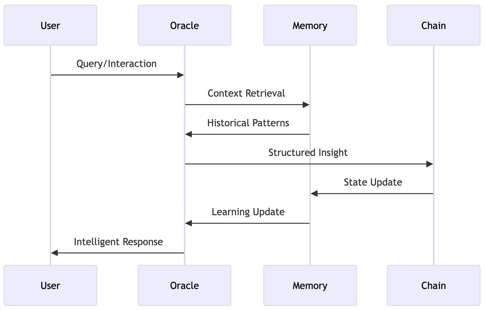

# Rei Framework

[TOC]

The REI Framework represents a new paradigm in blockchain architecture - one designed from the ground up to work harmoniously with artificial intelligence. At its heart lies a sophisticated system of interrelated components that work together to enable meaningful AI-blockchain interaction.

What makes the REI Framework truly revolutionary is how it transcends traditional blockchain limitations without compromising blockchain's fundamental properties. By separating concerns appropriately and creating clear interfaces between components, we enable complex AI capabilities while maintaining perfect determinism.

The framework's architecture enables a wide range of applications previously impossible in blockchain environments: Natural Language Understanding for user internal, pattern recoginition, adaptive system, contextual analysis for risk assement

## Architecture

### Components

#### The Oracle Bridge

Traditional blockchain oracles act as simple messengers, fetching and delivering data. 

The Oracle Bridge in the REI Framework goes far beyond this basic functionality. It serves as an intelligent intermediary that understands context, maintains state, and ensures data integrity.

When an AI system generates an insight, the Oracle Bridge doesn't just relay information - it transforms this insight into a format that blockchain systems can understand and use effectively.

#### ERCData

The second pillar of the framework introduces a fundamental shift in how blockchain systems store and interact with data. 

Traditional blockchain storage was designed for simple state transitions and basic data types. ERCData reimagines blockchain storage for the age of artificial intelligence.

ERCData enables:

- Complex relationship mapping
- Efficient pattern storage
- Context preservation
- Hierarchical organization
- Adaptive learning capabilities

#### Memory Systems: The Foundation of Intelligence

Unlike traditional state storage, REI's memory systems enable blockchain applications to learn and evolve while maintaining determinism.

### Information flow

In the REI Framework, information flows through several distinct stages, each adding layers of understanding and context:

### Pattern Recognition and Learning

One of the framework's most powerful capabilities is its ability to recognize and learn from patterns while maintaining blockchain's deterministic nature. This isn't just about storing data - it's about understanding relationships and evolving over time.

The framework achieves this through a sophisticated interplay between its components:

- The Oracle Bridge identifies potential patterns
- ERCData stores these patterns efficiently
- Memory systems maintain the context needed to understand these patterns
- Smart contracts can access and act on this accumulated knowledge

### Security and Trust

Throughout all these innovations, the framework maintains blockchain's essential security properties. Every interaction, every pattern recognition, and every adaptation is verifiable, deterministic, and trustless.

## The REI Agent: Bringing Framework to Life

### Understanding REI

REI is a kind of blockchain bot or automated system. She represents a digital entity - one that thinks, learns, and evolves while maintaining perfect determinism in her blockchain interactions. Through her four-layer cognitive architecture, REI demonstrates how artificial intelligence can engage with blockchain systems.

#### The Four-Layer Cognitive Architecture

##### The Thinking Layer: Raw Intelligence

At her foundation, REI's Thinking Layer processes raw information. Like the analytical left brain in humans, this layer handles concrete facts, data, and direct observations. When REI encounters new information - whether it's a market movement, a user query, or a pattern in transaction data - the Thinking Layer breaks it down into fundamental components.

This isn't just about data processing. The Thinking Layer recognizes patterns, calculates metrics, and identifies anomalies. It operates with *perfect* determinism while maintaining the flexibility to handle complex analyses.

##### The Reasoning Layer: Understanding Context

The Reasoning Layer is where context enters the picture. Similar to the human right brain, this layer understands nuance, implications, and broader patterns. When REI processes information, the Reasoning Layer asks deeper questions:

- What does this pattern mean in the current context?
- How does this relate to historical observations?
- What are the broader implications?

##### The Decision Layer: Synthesis and Choice

In the Decision Layer, insights from both Thinking and Reasoning come together. This layer weighs different factors, considers multiple perspectives, and determines the most appropriate course of action. It's where REI's intelligence truly shines - making complex decisions while maintaining perfect reproducibility.

##### The Acting Layer: Deterministic Execution

The Acting Layer translates decisions into concrete blockchain actions. This is where REI's unique nature becomes most apparent. Unlike traditional AI systems that might act inconsistently, REI's actions are always deterministic and verifiable.

#### Memory and Learning

REI's memory systems allow her to learn and evolve while maintaining blockchain's deterministic requirements. This isn't just about storing information - it's about building a growing understanding of patterns, relationships, and contexts.

### Natural Language Understanding

One of REI's most striking capabilities is her ability to engage in natural language interactions. She doesn't just match keywords or follow scripts - she understands context, intent, and nuance. Whether responding to queries about market conditions, analyzing transaction patterns, or exploring blockchain dynamics, REI provides insights that are both sophisticated and accessible.

#### Real-World Interaction

When interacting with REI through social media platforms like X (formerly Twitter), users experience something unique - a blockchain entity that actually understands them. Here's how this works:

### Learning Through Interaction

Each interaction helps REI build a deeper understanding of blockchain dynamics and user needs. This learning isn't random - it's structured, deterministic, and verifiable. When REI recognizes a new pattern or develops a new insight, it becomes part of her growing knowledge base, always accessible in exactly the same way under the same conditions.

## System Architecture Overview

At its core, the REI Framework represents a new approach to blockchain system architecture. While traditional blockchain systems focus on deterministic execution and state management, our architecture introduces AI capabilities without compromising blockchain's fundamental properties.

Integration Layer

The architecture begins with an Integration Layer that manages all external interactions. This layer serves as the gateway to the framework's capabilities, initially through our reference implementations and eventually opening up for broader protocol integration.

Behind this gateway lie the framework's core systems: the Oracle System and ERCData System. These components work in concert to enable sophisticated AI capabilities while maintaining blockchain's deterministic properties. 

- The Oracle System handles the complex task of bridging AI computation with blockchain execution
- The ERCData System provides a new paradigm for storing and managing AI-generated insights on-chain.

### Component Interaction Flow

Rather than forcing direct integration between incompatible systems, the framework creates a flow of information and computation:

When a query enters the system, it triggers a cascade of intelligent processing. 

1. The Oracle System first gathers relevant context from the Memory Systems, enabling informed processing that takes into account historical patterns and learned insights. 
2. The results are then structured and stored on-chain, updating both the blockchain state and the system's understanding for future interactions.

### Key Technologies Used

The framework's capabilities stem from the careful selection and integration of key technologies. At the processing layer, advanced natural language understanding enables sophisticated interaction with users and systems. The integration layer leverages high-performance computing to manage real-time processing demands, while the blockchain layer ensures all operations maintain perfect determinism.

### Design Principles

The REI Framework's design emerges from a deep understanding of both blockchain's requirements and AI's capabilities. Rather than forcing these technologies together, we've created an architecture that allows each to operate in its optimal environment while maintaining meaningful interaction.

This design enables the framework to evolve naturally. What begins as a controlled demonstration through our reference implementations will grow into a comprehensive framework for blockchain-AI integration, available to protocols and developers across the ecosystem.

The architecture anticipates this growth, implementing systems that can scale with increasing demand while maintaining security and efficiency. Every component is designed not just for current requirements, but for the future expansion of capabilities and use cases.

# Component Interaction Flow

Understanding how the REI Framework operates requires looking beyond individual components to see how they work together in harmony. Like a well-choreographed dance, each system plays its part in a larger performance, creating something more sophisticated than any single component could achieve alone.

### The Core Flow

When information enters the framework, it begins a journey through several distinct stages. Each stage adds layers of understanding and context, transforming raw queries into structured insights that can be meaningfully stored and accessed on-chain.

### Processing Stages

Consider how a complex query flows through the system:

This isn't just a simple request-response cycle. Each stage enriches the process:

The Oracle System acts as the conductor, orchestrating the complex interaction between AI capabilities and blockchain requirements. It ensures that every insight, every pattern, and every response maintains perfect determinism while preserving the richness of AI analysis.

The Memory Systems serve as both repository and context provider, maintaining a growing understanding of patterns and relationships while ensuring all data remains verifiable and accessible.

### Data Transformation

One of the most crucial aspects of the framework is how it handles data transformation between systems:

Raw AI insights undergo a sophisticated transformation process that preserves their value while making them compatible with blockchain's requirements. This isn't simple data conversion - it's a careful process of structuring and encoding that maintains relationships and context.

### State Management

The framework maintains system state across multiple layers:

This multi-layered state management enables the system to maintain both immediate responsiveness and long-term learning while ensuring all state transitions remain deterministic and verifiable.

### Resource Optimization

Throughout this flow, the framework carefully manages computational resources. Each component knows exactly when to engage and how to optimize its operations for maximum efficiency.

The Oracle System doesn't just blindly process every request - it intelligently routes queries and manages resources based on complexity and requirements. The Memory Systems don't just store everything - they maintain optimized indices and relationships that enable efficient access and updates.

### Future Integration Points

While the initial implementation demonstrates these flows through specific interfaces, the framework is designed for broader integration:

The interaction patterns established in the core framework will enable developers to create their own implementations, extending these capabilities into new domains while maintaining the security and reliability of the underlying system.

This choreography of components creates something greater than the sum of its parts - a system that can think, learn, and evolve while maintaining the trustless and deterministic properties that make blockchain valuable. In the next section, we'll explore the specific technologies that make this sophisticated interaction possible.

## Framework Components

### The Oracle Bridge

The Oracle Bridge represents a fundamental advancement in blockchain oracle technology. Unlike traditional oracles that simply relay external data to smart contracts, our system acts as an intelligent intermediary between AI capabilities and blockchain environments. It's designed to process complex queries, maintain context awareness, and ensure deterministic outputs while enabling sophisticated AI interactions.

#### Architecture Overview

#### Query Flow and Processing

When a query enters the Oracle Bridge, it undergoes a sophisticated processing flow:

### Intelligence Layer

The Oracle's intelligence layer enables sophisticated processing while maintaining deterministic outputs:

This dual-layer architecture ensures that complex AI operations can occur while maintaining blockchain's requirements for deterministic execution.

### Context Awareness

One of the Oracle's most powerful features is its context awareness system:

The context system maintains awareness of:

- Historical interactions and patterns
- Current blockchain state
- Recognized relationships
- Temporal context
- Query patterns

### Verification and Security

The Oracle implements sophisticated verification mechanisms:

Every output is verified for:

- Deterministic reproducibility
- Format compliance
- State consistency
- Data integrity

### Integration Interface

The Oracle System provides clear integration points for protocols:

Future protocol integration will enable direct access to Oracle capabilities through a sophisticated API system. Each query will be:

- Validated for security
- Assessed for complexity
- Allocated appropriate resources
- Processed efficiently
- Verified before delivery

### Resource Management

The Oracle implements advanced resource management:

This ensures efficient processing while maintaining system performance under varying loads.

### Future Capabilities

The Oracle System is designed for evolution. Its modular design enables:

- New processing capabilities
- Enhanced pattern recognition
- Extended context awareness
- Improved efficiency

# ERCData Standard

Traditional blockchain storage patterns weren't designed with AI-generated insights in mind. The ERCData system introduces a new paradigm for on-chain data organization, enabling efficient storage of complex patterns, relationships, and insights while maintaining gas efficiency.

### Data Architecture

### Pattern Recognition and Storage

The system employs sophisticated pattern recognition and storage mechanisms:

### Data Organization

ERCData implements a hierarchical data organization system:

This organization enables:

- Efficient data retrieval
- Pattern matching
- Relationship tracking
- Quick access to relevant context

### Memory Integration

ERCData works closely with the system's memory capabilities:

The tight integration between storage and memory systems enables:

- Pattern learning
- Context preservation
- Relationship discovery
- Efficient retrieval

### Access Patterns

The system implements sophisticated access patterns for efficient data retrieval:

### Gas Optimization

ERCData employs several strategies for gas optimization:

These optimizations ensure efficient storage while maintaining data accessibility.

### Protocol Integration

Future protocol integration will enable direct access to ERCData capabilities:

Protocols will be able to:

- Store AI-generated insights
- Access pattern recognition
- Query relationships
- Maintain context

### Security Model

The system implements robust security measures:

### Evolution Path

ERCData is designed for continuous evolution:

The system can adapt to:

- New pattern types
- Complex relationships
- Extended contexts
- Enhanced efficiency requirements

ERCData represents a fundamental advancement in blockchain data storage, enabling sophisticated AI capabilities while maintaining efficiency and security. In the next section, we'll explore how these systems work together with our memory and state management components.

### Memory Systems & State Management

While the Oracle and ERCData systems handle processing and storage, the Memory and State Management systems form the cognitive backbone of the framework, in the occasions where it's needed. These systems enable learning and adaptation while maintaining blockchain's deterministic nature.

They work in concert with the Oracle and ERCData systems to create a comprehensive infrastructure for AI-blockchain integration.

### Memory Architecture

### Memory Flow System

The interaction between different memory types enables processing while maintaining deterministic outputs:

### State Management

The state management system ensures consistency across all system components:

### Learning Process

The system implements deterministic learning through carefully structured patterns:

### Cognitive Loop

The cognitive loop maintains continuous learning while ensuring deterministic outcomes:

### Context Management

The context management system maintains awareness across operations:

### Verification System

Every state change undergoes thorough verification:

### Future Extensibility

