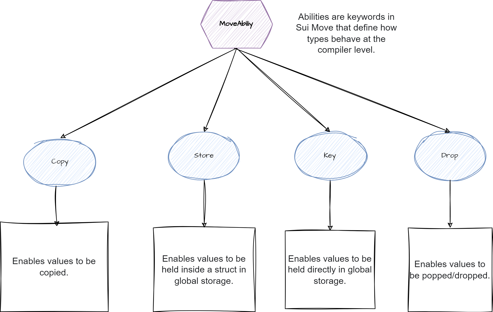

# SUI objects - Overview

[TOC]

## Summary

On the Sui blockchain, the fundamental building block is the **object**. Unlike traditional account-based blockchains that store state as key-value pairs inside user accounts, Sui organizes all on-chain data around uniquely identifiable objects. Each object is defined and governed by Sui Move smart contracts, and can represent anything from a token or game asset to a complex programmable resource.

### Reminder




### Tab

|                      | Description                                                  | Accessibility                                                | Transfer       | Requirement                                                  | Creation                                                     |      |
| -------------------- | ------------------------------------------------------------ | ------------------------------------------------------------ | -------------- | ------------------------------------------------------------ | ------------------------------------------------------------ | ---- |
|                      |                                                              |                                                              |                |                                                              |                                                              |      |
| Address-Owned Object |                                                              | An address-owned object is accessible only to its owner and no others. | Only the owner |                                                              | public fun transfer<T: key>(obj: T, recipient: address)<br/>public fun public_transfer<T: key + store>(obj: T, recipient: address) |      |
| Immutable Objects    | An immutable object cannot be mutated, transferred, or deleted, have no owner and are freely accessible to everyone. |                                                              |                |                                                              | `public_freeze_object` function from the [transfer module](https://github.com/MystenLabs/sui/blob/main/crates/sui-framework/packages/sui-framework/sources/transfer.move): |      |
| Party Objects        |                                                              |                                                              |                |                                                              | sui::transfer::party_transfer` or `sui::transfer::public_party_transfer |      |
| Shared Objects       |                                                              |                                                              |                | `key`                                                        | sui::transfer::share_object                                  |      |
| Wrapped Objects      |                                                              |                                                              |                | To embed a struct type in a Sui object struct (with a `key` ability), the struct type must have the `store` ability. |                                                              |      |


## Address-Owned Objects

> https://docs.sui.io/concepts/object-ownership/address-owned

An address-owned object is owned by a specific 32-byte address that is either an account address (derived from a particular signature scheme) or an object ID. An address-owned object is accessible only to its owner and no others.

As the owner (of the address that owns) an address-owned objects, you can transfer it to different addresses. Because only a single owner can access these objects, you can execute transactions that use only owned objects in parallel with other transactions that don't have any objects in common without needing to go through consensus.

### Creating address-owned objects

> https://docs.sui.io/concepts/object-ownership/address-owned#creating-address-owned-objects

Use these [transfer module](https://github.com/MystenLabs/sui/blob/main/crates/sui-framework/packages/sui-framework/sources/transfer.move) functions to create address-owned objects:

```move
public fun transfer<T: key>(obj: T, recipient: address)
public fun public_transfer<T: key + store>(obj: T, recipient: address)
```


You should use the `sui::transfer::transfer` function if you are defining a [custom transfer policy](https://docs.sui.io/concepts/transfers/custom-rules) for the object. Use the `sui::transfer::public_transfer` function to create an address-owned object if the object has the `store` capability.

After you declare an object as address-owned, its ownership can change over the life of that object - either by adding it as a dynamic object field, transferring it to a different address, or making it immutable. Importantly though, after you create an object and set its ownership, it cannot be shared.

### Accessing address-owned objects

> https://docs.sui.io/concepts/object-ownership/address-owned#accessing-address-owned-objects

You can access address-owned objects in two different ways, depending on whether or not the address owner of the object corresponds to an object ID.

If the address owner of the object corresponds to an object ID, then you must access and dynamically authenticate it during the execution of the transaction using the mechanisms defined in [Transfer to Object](https://docs.sui.io/concepts/transfers/transfer-to-object).

If the address owner of the object is a signature-derived address (an account address), then you can use and access it directly as an owned object during the execution of a transaction that address signs. Other addresses cannot access owned objects in any way in a transaction - even to just read the object.

### When to use address-owned objects

> https://docs.sui.io/concepts/object-ownership/address-owned#when-to-use-address-owned-objects

Use address-owned objects when you need:

- Single ownership at any time
- Better performance than shared objects
- Avoidance of consensus sequencing

### Example

> https://docs.sui.io/concepts/object-ownership/address-owned#example

An example of an object that is frequently address-owned is that of a [Coin object](https://github.com/MystenLabs/sui/blob/main/crates/sui-framework/packages/sui-framework/sources/coin.move). If address `0xA11CE` had a coin `C` with 100 SUI and wanted to pay address `0xB0B` 100 SUI, `0xA11CE` could do so by transferring `C` to `0xB0B`.

```move
transfer::public_transfer(C, @0xB0B);
```

This results in `C` having a new address owner of `0xB0B`, and `0xB0B` can later use that 100 SUI coin.

------

## Immutable object

Immutable objects are objects in Sui that **cannot be mutated, transferred, or deleted**. They have **no owner** and are **freely accessible** by anyone on the network.

------

### Creating Immutable Objects

1. **Freeze an existing object:**

   ```
   public native fun public_freeze_object<T: key>(obj: T);
   ```

   - Permanently makes the object immutable.

   - Must pass the object **by value** to prevent further mutation.

   - Example:

     ```
     let c = new(255, 0, 255, ctx);
     transfer::public_freeze_object(c);
     ```

2. **Create an object as immutable directly:**

   ```
   public fun create_immutable(red: u8, green: u8, blue: u8, ctx: &mut TxContext) {
       let color_object = new(red, green, blue, ctx);
       transfer::public_freeze_object(color_object);
   }
   ```

------

### Using Immutable Objects

- Immutable objects can **only be passed as read-only references** (`&T`).

- Multiple transactions can safely read immutable objects simultaneously, **without consensus overhead**.

- Example:

  ```
  public fun copy_into(from: &ColorObject, into: &mut ColorObject);
  ```

  - `from` can be immutable, `into` must be mutable.

------

### Testing Immutable Objects

- Use `test_scenario::take_immutable<T>` to access the object.

- Use `test_scenario::return_immutable` to return it after use.

- Any sender can access immutable objects; ownership is irrelevant.

- Example:

  ```
  let object = test_scenario::take_immutable<ColorObject>(scenario);
  test_scenario::return_immutable(object);
  ```

- Attempting mutation on immutable objects fails:

  ```
  public fun update(&mut object: ColorObject, red: u8, green: u8, blue: u8) { ... }
  ```

------

### On-Chain Interaction

1. **View objects you own:**

   ```
   $ sui client objects $ADDR
   ```

2. **Publish module** and create a ColorObject:

   ```
   $ sui client publish ...
   $ sui client call ... --function "create" --args 0 255 0
   ```

3. **Freeze object to make it immutable:**

   ```
   $ sui client call ... --function "freeze_object" --args "$OBJECT"
   ```

4. **Verify immutability:**

   - Object owner shows: `Immutable`
   - Mutation attempts fail with an error.

------

**Key Points:**

- Immutable objects are **ownerless, read-only, and universally accessible**.
- They ensure **safe concurrent access** and simplify handling in tests and on-chain programs.
- Freezing is **permanent**; plan carefully before freezing objects.

----

## Party Objects

A party object is an object that is transferred using the `sui::transfer::party_transfer` or `sui::transfer::public_party_transfer` function. It is accessible to the `Party` to which it is transferred.

Party objects combine some properties of address-owned objects and shared objects. Like address-owned objects, they can be owned by a single address. Like shared objects, they are versioned by consensus. Unlike shared objects, they can be transferred to and from other ownership types and wrapped.

info

Currently, single ownership is the only supported mode for party objects. This topic will be updated if support for multiple owners or more granular permissions is added.

### Creating party objects

> https://docs.sui.io/concepts/object-ownership/party#creating-party-objects

Use one of the following functions (defined in the [transfer module](https://github.com/MystenLabs/sui/blob/main/crates/sui-framework/packages/sui-framework/sources/transfer.move)) to create party objects:

```move
public fun party_transfer<T: key>(obj: T, party: sui::party::Party)
public fun public_party_transfer<T: key + store>(obj: T, party: sui::party::Party)
```


Use the `sui::transfer::party_transfer` function if you are defining a [custom transfer policy](https://docs.sui.io/concepts/transfers/custom-rules) for the object. Use the `sui::transfer::public_party_transfer` function if the object has the `store` capability.

A party object's ownership can change over its lifetime. For example, by adding it as a dynamic object field, transferring it to a different address or owner type, or making it immutable. One exception: after you create an object and set its ownership, you cannot later share it.

### Accessing party objects

> https://docs.sui.io/concepts/object-ownership/party#accessing-party-objects

You can specify party objects as input to a transaction in the same way as shared objects. Sui validators ensure that the sender of the transaction can access the object. The validator might abort a transaction at execution time if the owner of an input party object has changed due to an earlier, conflicting transaction.

Party objects whose owning address corresponds to an object ID are not supported for access through the [transfer to object](https://docs.sui.io/concepts/transfers/transfer-to-object) mechanism.

### When to use party objects

> https://docs.sui.io/concepts/object-ownership/party#when-to-use-party-objects

Use party objects when you want an object to be versioned by consensus, such as for operational convenience. If an object is only used with other party or shared objects, converting it to a party object has no additional performance cost.

Party objects can be used by multiple inflight transactions at the same time. This contrasts with address-owned objects, which only allow a single inflight transaction. Many applications can benefit from the ability to pipeline multiple transactions on the same party object.

info

`Coin`s can be party objects, including `Coin<SUI>`. However, you can't use a party object `Coin<SUI>` for gas payment. To use a party object `Coin<SUI>` for gas, you must first transfer it back to address-owned.


---

## Shared Objects

Use the `sui::transfer::share_object` function to create a shared object, making it publicly accessible on the network. Extended functionality and accessibility of shared objects requires additional effort by securing access, if needed.

Shared objects require the `key` ability.

### Usage example

> https://docs.sui.io/concepts/object-ownership/shared#usage-example

The following example creates a shop to sell digital donuts. Everyone needs access to the shop to purchase donuts from it, so the example creates the shop as a shared object using `sui::transfer::share_object`.

```rust
module examples::donuts;

use sui::sui::SUI;
use sui::coin::{Self, Coin};
use sui::balance::{Self, Balance};

/// For when Coin balance is too low.
const ENotEnough: u64 = 0;

/// Capability that grants an owner the right to collect profits.
public struct ShopOwnerCap has key { id: UID }

/// A purchasable Donut. For simplicity's sake we ignore implementation.
public struct Donut has key { id: UID }

/// A shared object. `key` ability is required.
public struct DonutShop has key {
    id: UID,
    price: u64,
    balance: Balance<SUI>
}

/// Init function is often ideal place for initializing
/// a shared object as it is called only once.
fun init(ctx: &mut TxContext) {
    transfer::transfer(ShopOwnerCap {
        id: object::new(ctx)
    }, ctx.sender());

    // Share the object to make it accessible to everyone!
    transfer::share_object(DonutShop {
        id: object::new(ctx),
        price: 1000,
        balance: balance::zero()
    })
}

/// Entry function available to everyone who owns a Coin.
public fun buy_donut(
    shop: &mut DonutShop, payment: &mut Coin<SUI>, ctx: &mut TxContext
) {
    assert!(coin::value(payment) >= shop.price, ENotEnough);

    // Take amount = `shop.price` from Coin<SUI>
    let paid = payment.balance_mut.split(shop.price);

    // Put the coin to the Shop's balance
    shop.balance.join(paid);

    transfer::transfer(Donut {
        id: object::new(ctx)
    }, ctx.sender())
}

/// Consume donut and get nothing...
public fun eat_donut(d: Donut) {
    let Donut { id } = d;
    id.delete();
}

/// Take coin from `DonutShop` and transfer it to tx sender.
/// Requires authorization with `ShopOwnerCap`.
public fun collect_profits(
    _: &ShopOwnerCap, shop: &mut DonutShop, ctx: &mut TxContext
) {
    let amount = shop.balance.value();
    let profits = shop.balance.split(amount).into_coin(ctx);

    transfer::public_transfer(profits, ctx.sender())
}
```


------

### Wrapped Objects in Sui Move

**Concept:**
Wrapping allows one Sui object to contain another, turning the inner object into part of the wrapper. Once wrapped, the inner object:

- Cannot be accessed independently on-chain.
- Cannot be passed as an argument in transactions.
- Retains its original ID when unwrapped.
- Circular wrapping (A wraps B, B wraps C, C wraps A) is **not allowed**.

**Unwrapping:**

- Restores the object’s independence.
- Allows modification, transfer, or deletion.

### Ways to Wrap Objects

1. **Direct Wrapping**
   - A wrapper object contains another object as a field.
   - Ensures **strong encapsulation**; the wrapped object cannot be extracted without destroying the wrapper.
   - **Use case:** Trusted swaps of NFTs or other valuable objects.
   - Example: `SwapRequest` wraps an object and tracks its owner and fees for swapping through a service.
2. **Wrapping via `Option`**
   - Allows **optional containment**: the wrapper may or may not have the object.
   - Flexible: objects can be added, replaced, or removed.
   - Example: `SimpleWarrior` wraps `Sword` and `Shield` using `Option`, allowing dynamic equipping and replacement.
3. **Wrapping via `vector`**
   - Allows multiple objects of the same type to be contained in a list.
   - Example: `Farm` wraps a vector of `Pet` objects.

### Key Properties

- Wrapped objects **cannot be independently mutated**; access is only through the wrapper.
- Wrapping enforces **ownership control** and is cheaper than using shared objects.
- Wrapping supports **modular design**: objects can be nested, optional, or in collections.

## Reference

- SUI documentation: 
- ChatGPT