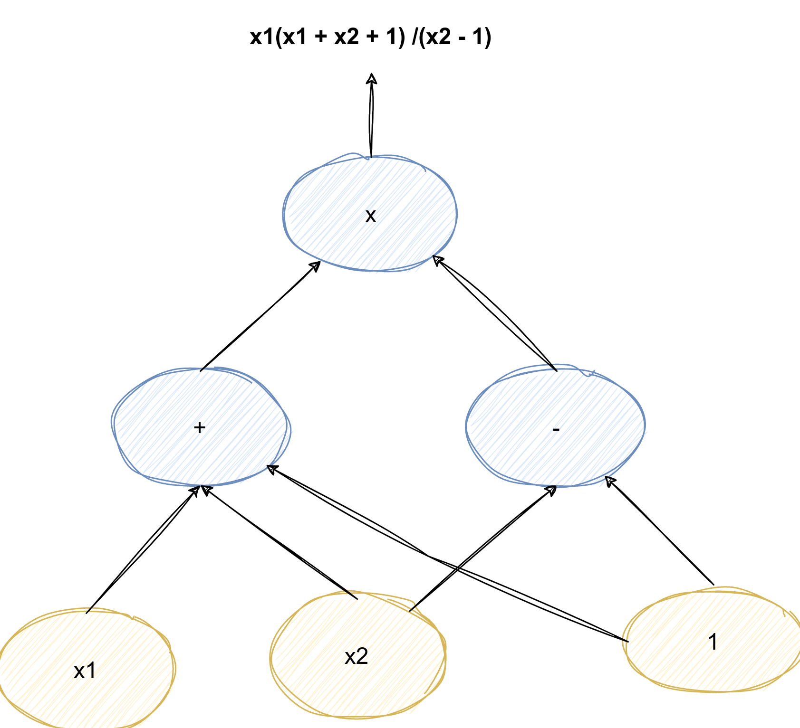

### Understanding zk-SNARK: A Deep Dive into Zero-Knowledge Proofs

#### Introduction to zk-SNARK

zk-SNARK stands for **Zero-Knowledge Succinct Non-Interactive Argument of Knowledge**. 

Zhey were introduced in a [2012 paper](https://dl.acm.org/doi/10.1145/2090236.2090263) co-authored by Nir Bitansky, Ran Canetti, Alessandro Chiesa, and Eran Tromer.

It is a cryptographic technique that allows one party (the prover) to prove to another party (the verifier) that they know a piece of information, such as a secret key, without revealing the information itself. This groundbreaking method is widely used in blockchain technology to enhance privacy and scalability.

**Core properties:**

- **Zero-Knowledge**: No knowledge beyond the validity of the statement is revealed.
- **Succinct**: The proofs are very small and quick to verify.
- **Non-Interactive**: A single message from the prover is sufficient.

- The "zero-knowledge" aspect ensures that no information other than the validity of the claim is shared
- "succinct" implies that the proof is small and verifiable quickly
-  "non-interactive" means the proof does not require back-and-forth communication between the prover and verifier after its generation.

[TOC]

------

## History

Zero-Knowledge interactive proof protocols were the starting point of zk-SNARKs. 

Goldwasser, Micali, and Racknoff first introduced sound, complete, and zero-knowledge interactive proof systems for Quadratic − Residuosity and Quadratic − No residuosity, two languages in not known to be efficiently recognizable 

- Subsequently, Blum, Feldman, and Micali developed non-interactive zero-knowledge (NIZK) proofs, using shared randomness to create a common reference string (CRS). 

  Unlike the protocol for G3COL, a noninteractive protocol requires just one message to be sent from prover to verifier, cutting out the back-and-forth interaction. This feature is especially important in blockchain rollups, so that the prover does not need to be around every time someone wants to verify their proof. The next key innovation was in reducing the size of the proof sent. Kilian [9] gave an interactive protocol for sublinear zero-knowledge arguments that sent fewer bits than the size of the statement to be proved. Micali then created the first sublinear-size NIZK proofs [10]. The next goal was to make proofs constant size. Groth, Ostrovsky, and Sahai [11, 12] introduced pairing-based NIZK proofs. Using these ideas, Groth developed the first constant-size NIZK arguments system for Circuit − SAT, an NP-complete language [13]. Groth’s protocol used pairings to efficiently check polynomial relationships between the discrete logs (the decoded versions) of the prover’s encoded messages, without needing to know the decoded messages themselves. The proof is created so that checking a particular polynomial relationship between elements of the proof is equivalent to verifying that prover has a satisfying assignment for the circuit, a core idea in current zk-SNARKs. 2

------

## Key Components of zk-SNARK

### Arithmetic circuits

zk-SNARKs work by transforming computations into arithmetic circuits. Each computation step becomes part of a mathematical representation.

A function `f(x)` is represented as a sequence of arithmetic operations (additions and multiplications). Each gate has constraints on its inputs and output.

An arithemetic circuit is:

- Direct acyclic graph (DAG) where 
  - internal nodes are labeled +,-, or x
  - Inputs are labeled 1,x1, ....,xn
- Defines an n-variate polynomial with an evualation recipe
- Fix a finite Field 

$$
F = {0,..., p-1} ~for~some~prime~p >2
$$

$$
C: F^n - >F
$$
Example:

#### Structured vs. unstructured circuits 

An unstructured circuit: a circuit with arbitrary wires input ⋯ output 

Some SNARK techniques only apply to structured circuits

### NARK: Non-interactive ARgument of Knowledge (preprocessing)

A preprocessing NARK is a triple (S, P, V):

- S(C) -> public parameters (pp, vp) for prover and verifier
- P(PP, x, w) -> Proof PI
- V(vp, x, PI) -> accept or reject 

where

- x is a public statement in Fn

- w is a secret witness in F^m

### SNARK: a Succinct ARgument of Knowledge

A succing preprocessing NARK is a triple (S, P, V):

- S(C) -> public parameters (pp, vp) for prover and verifier
- P(PP, x, w) -> **short** Proof PI

$$
len(PI) = sublinear(|w|)
$$

- V(vp, x, PI) ->  fast to verify

$$
time(V) = O_gamm(|x|), sublinera(|C|)
$$

Example sublinera function
$$
f(n) = racine n
$$

### Snark and kz-snark difference

SNARK: a NARC (complete and knowledge sound) that is succinct 

zk-SNARK: a SNARK that is also zero knowledge

### Quadratic Arithmetic Programs (QAPs)

 These express the circuit's constraints, which must be satisfied to verify the proof.

A QAP encodes the correctness of the circuit into polynomial form. For a valid computation, the polynomials P(x), Q(x), and Z(x) must satisfy:
$$
P(x) \cdot Q(x) = h(x) \cdot Z(x)
$$
Where:

- P(x), Q(x): Encoded left and right input polynomials.
- Z(x): Target polynomial (vanishing polynomial).
- h(x): Witness polynomial (proof that computation is correct).

### Pairing-Based Cryptography

zk-SNARKs use elliptic curve pairings to create verifiable commitments. Given two cyclic groups G1  and G2, and a bilinear pairing e:G1×G2→GT :  we have:
$$
e(aP, bQ) = e(P, Q)^{ab}
$$
This property is used to verify polynomial relationships without revealing the witness.

1. **Trusted Setup**: A crucial step where parameters are generated. These parameters are public and enable the creation of proofs, but their security depends on the assumption that the private "toxic waste" from the setup remains undisclosed. "As such, trusted setups are commonly run with many participants to render the possibility of this occurrence low enough."

------

#### Applications of zk-SNARKs

- **Blockchain Privacy**: zk-SNARKs are prominently used in cryptocurrencies like Zcash, allowing users to hide transaction details while still ensuring their validity.

other use in public blockchain: tornado cash, IronFish + Aleo (private Dapps)

ZCash:

y. [Zcash](https://z.cash/) was the first widespread application of zk-SNARKs, applying the technology to create shielded transactions in which the sender, recipient, and amount are kept private. Shielded transactions in Zcash can be fully encrypted on the blockchain yet still be verified as valid under the network’s consensus rules by using zk-SNARKs. [https://chain.link/education-hub/zk-snarks-vs-zk-starks](https://chain.link/education-hub/zk-snarks-vs-zk-starks)

- **Compliance & Identity Verification**: Enables proving identity attributes (e.g., age or citizenship) without revealing detailed personal data.
- **Scalable Computation**: zk-SNARKs can compress complex computations into verifiable proofs, reducing the load on verifiers in distributed systems.

------

#### Comparison with Other Zero-Knowledge Systems

| **Feature**            | **zk-SNARK**                         | **zk-STARK**                      | **Bulletproofs**                  |
| ---------------------- | ------------------------------------ | --------------------------------- | --------------------------------- |
| **Proof Size**         | Very small O(1)                      | Larger than zk-SNARK O(logn) | Larger than zk-SNARK O(logn) |
| **Verification Speed** | Extremely fast O(1)                  | Slower than zk-SNARK O(logn) | Comparable Slower O(n)       |
| **Trusted Setup**      | Required                             | Not required                      | Not required                      |
| **Scalability**        | High                                 | Very high                         | Moderate                          |
| **Quantum Resistance** | ❌ Vulnerable to quantum attacks | ✅Resistant                        | ⚠️Partially resistant              |

- **zk-STARK (Zero-Knowledge Scalable Transparent Arguments of Knowledge)** removes the need for a trusted setup and is quantum-resistant. However, zk-STARK proofs are larger and slower to verify.

- **Bulletproofs**, on the other hand, are non-interactive and efficient but lack succinctness for highly complex computations.

------

#### Security of zk-SNARKs Against Quantum Computers

The security of zk-SNARKs relies on cryptographic primitives like elliptic curve pairings and discrete logarithms. These problems are computationally hard for classical computers but susceptible to attacks by quantum computers, particularly with Shor's algorithm. A sufficiently powerful quantum computer could compromise the integrity of zk-SNARK-based systems.

In contrast, zk-STARKs use hash-based cryptographic techniques, making them inherently resistant to quantum threats. 

As the development of quantum computers progresses, systems based on zk-SNARKs will need to transition to quantum-secure alternatives to maintain their security guarantees.

### Variant

**SNARKs**

- A general approach to constructing a trusted setup SNARK: [Succinct Non-Interactive Arguments via Linear Interactive Proofs](https://eprint.iacr.org/2012/718)
- [The Groth’16 SNARK](https://eprint.iacr.org/2016/260)
- The [Plonk](https://eprint.iacr.org/2019/953) preprocessing universal SNARK. See also [this writeup](https://vitalik.ca/general/2019/09/22/plonk.html).
- The [Marlin](https://eprint.iacr.org/2019/1047)preprocessing universal SNARK.
- The [Spartan SNARK](https://eprint.iacr.org/2019/550) using multilinear polynomials. So also [this improvement](https://eprint.iacr.org/2020/1275).
- [STARK](https://aszepieniec.github.io/stark-anatomy/): a post-quantum transparent proof system, a tutorial.
- https://drive.google.com/file/d/123zkBhJqti2rQeqKGobxYD3UPQwAD_46/view

## Plonk

Universal and Updateable Trusted Setup: 

Like many other zero-knowledge proof schemes, PLONK still requires a trusted setup procedure. In a trusted setup, a set of initial parameters is generated, and the security of the scheme depends on keeping these parameters secret.

- PLONK's trusted setup is universal and updateable. This means that instead of needing a separate trusted setup for each program to be proven, there is one single trusted setup that can be used with any program (up to a certain maximum size defined during setup). 
- The trusted setup can involve multiple parties, and it remains secure as long as at least one of the participants is honest. 
- This multi-party procedure is sequential, allowing participants to be added over time, which increases the safety of the setup in practice.

PLONK relies on a single standardized component called a "polynomial commitment." Polynomial commitments are cryptographic tools that enable efficient verification of polynomial equations. PLONK uses "Kate commitments," which are based on trusted setups and elliptic curve pairings. However, the scheme is flexible, allowing alternative schemes like FRI or DARK to be used instead. This means that different trade-offs between proof size and security assumptions can be achieved by swapping out the polynomial commitment scheme. The ability to choose different schemes caters to various use cases and developer preferences.

https://zkplabs.network/blog/Introduce-PLONK-Revolutionizing-ZK-SNARK-Technology-for-Efficiency-and-Privacy

## Who Use snark:

- Starkware, Aztec, MatterLabs, Espresso systems, Risk Zero, Scroll, Polyon, Alexo Suppra National, INgonyama

### Outsourcing computation

Outsourcing computation: (no need for zero knowledge):

L1 chain quickly verifies the work of an off-chain service 

Examples: 

- Scalability: proof-based Rollups (zkRollup) off-chain service processes a batch of Tx; 
  - L1 chain verifies a succinct proof that Tx were processed correctly 

- Bridging blockchains: proof of consensus (zkBridge) enables transfer of assets from one chain to another

Referebce: zk-learning, https://rdi.berkeley.edu/zk-learning/assets/Lecture2-2023.pdf

### Privacy

Some applications require zero knowledge (privacy): 

- Private Tx on a public blockchain: 
  - zk proof that a private Tx is valid (Tornado cash, Zcash, IronFish, Aleo) 
- Compliance: 
  - Proof that a private Tx is compliant with banking laws (Espresso) 
  - Proof that an exchange is solvent in zero-knowledge (Raposa)

#### ZCash - Halo2

*With [Network Upgrade 5 (NU5)](https://z.cash/upgrade/nu5/) in May 2022, Zcash introduced the Orchard shielded payment protocol, which utilizes the [Halo 2](https://electriccoin.co/blog/technical-explainer-halo-on-zcash/) zero-knowledge proving system. Halo is a new zk-SNARK that’s finally capable of solving two outstanding issues in Zcash: removing the trusted setup while hitting performance targets and supporting a scalable architecture for private digital payments.* 

https://z.cash/learn/what-are-zk-snarks/

#### Mina  - Pickles

Certain zk-SNARKs, like [Pickles](https://minaprotocol.com/blog/meet-pickles-snark-enabling-smart-contracts-on-coda-protocol) that’s used in Mina, support a concept of recursion — that a proof can refer to itself — and doing this doesn’t increase the size of the proof, no matter how many times we refer to the initial one. That recursion, or picture of a picture, is what allows Mina to stay small.

https://minaprotocol.com/blog/what-are-zk-snarks

https://minaprotocol.com/blog/a-guide-to-zk-snarks

### Atzec - Plonk

------

#### Conclusion

zk-SNARKs are a revolutionary tool in the cryptographic landscape, enabling privacy-preserving, efficient, and scalable solutions across various domains. 

However, the reliance on trusted setups and their vulnerability to quantum computers are notable challenges. 

While zk-STARKs and Bulletproofs offer alternatives with distinct trade-offs, zk-SNARKs remain a cornerstone of zero-knowledge proof technology, pushing the boundaries of what is possible in privacy and security.

Future advancements in quantum-resistant algorithms and decentralized trusted setups will likely shape the evolution of zk-SNARKs, ensuring their relevance in a post-quantum era.

https://www.youtube.com/watch?v=h-94UhJLeck

https://chain.link/education-hub/zk-snarks-vs-zk-starks

https://www.youtube.com/watch?v=gcKCW7CNu_M

Reference: Write me an article about zk Snark. Make also a comparison with other systems and its security again quantum computer

## Various links

https://zokrates.github.io/introduction.html

https://crypto.stanford.edu/~saba/slides/Quals.pdf