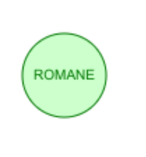
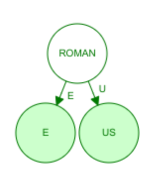
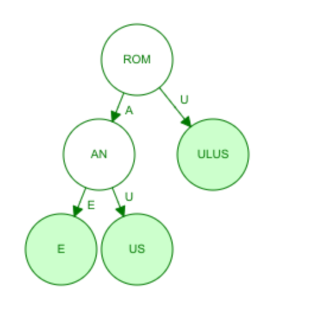
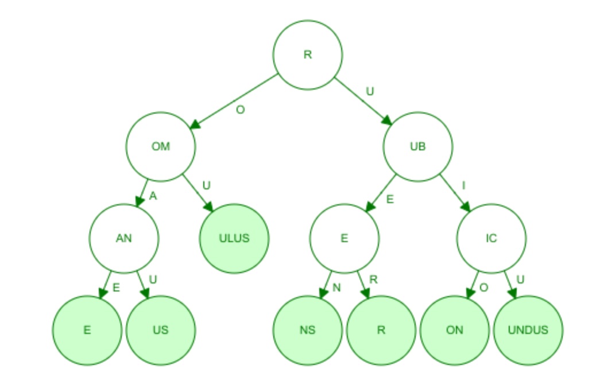

In computer science and cryptography, Merkle trees are widely used for ensuring data integrity and efficient verification. Merkle Trees were invented in 1979 by  Ralph Merkle.

Various adaptations of this structure have been developed to address different computational and storage challenges. 

These variations, such as Merkle DAGs (Directed Acyclic Graphs) and Patricia Trees, enhance flexibility, scalability, and performance across a range of applications. 

This article explores the foundational concept of Merkle trees, examines their key variants, and highlights their real-world implementations.

[TOC]

------

### What is a Merkle Tree?

A **Merkle tree**, also called a **hash tree**, is a data structure that efficiently and securely verifies the integrity of large datasets. At its core, a Merkle tree organizes data into a hierarchical structure:

- **Leaf nodes** contain the hash of data blocks.
- **Non-leaf nodes** store the cryptographic hash of their child nodes.

The tree culminates in a **Merkle root**, representing the entire dataset's integrity. Any change in the underlying data causes a change in the Merkle root, enabling tamper detection.

This structure allows for the verification of the contents of a large set of data without the need to access every individual element. Instead, a **Merkle root** — the hash at the top of the tree — can be used to represent the entire dataset. By hashing the data in a way that each node depends on the integrity of its children, any change in the data results in a completely different Merkle root, allowing for easy detection of any tampering.

Schema from [Wikipedia](https://en.wikipedia.org/wiki/Merkle_tree)

### How Do Merkle Trees Work?

The process of constructing a Merkle tree involves several steps:

1. **Data Hashing**: Start by hashing the individual data blocks (usually using cryptographic hash functions such as SHA-256).
2. **Pairing Hashes**: Pair the hashed data and compute the hash of the pair. This continues recursively up the tree until only one hash remains: the Merkle root.
3. **Merkle Root**: This root represents the entire dataset and can be used for validation purposes. If any data is altered, the Merkle root will change, signaling that the data has been tampered with.

For example, if we have four data blocks A, B, C, and D, the steps would look like this:

- Hash(A), Hash(B), Hash(C), Hash(D)
- Hash(Hash(A) + Hash(B)) and Hash(Hash(C) + Hash(D))
- Merkle Root = Hash(Hash(Hash(A) + Hash(B)) + Hash(Hash(C) + Hash(D)))

### Advantages of Merkle Trees

1. **Efficiency**: Merkle trees allow for efficient data verification. Instead of checking every data block, only the hashes along the path from a leaf to the Merkle root need to be verified.
2. **Security**: By utilizing cryptographic hash functions, Merkle trees ensure that any change in the data will lead to a completely different Merkle root, making it easy to detect tampering.
3. **Scalability**: Merkle trees are particularly useful for large datasets, as they provide a compact representation of data integrity without needing to store the entire dataset.

------

### Merkle Tree Variation

In practice, ofthen the Merkle Tree is adapted to offer more flexibility and functionality and to meet the demands of specific use case. Below are some of the most known variations.

#### Merkle DAG (Directed Acyclic Graph)

In a traditional Merkle tree, the structure is a strict binary tree. In contrast, a **Merkle DAG** allows for multiple parents and does not enforce a strict tree-like structure. This variant is used in systems like the **InterPlanetary File System (IPFS)** and **Git** for version control.

- **How It Works**: A Merkle DAG is a graph where nodes are hashes of data or other nodes, and edges represent relationships. The "acyclic" nature ensures no loops, maintaining a directional flow of data dependency.
- Benefits:
  - Efficient storage: Data deduplication is inherent as identical subgraphs share the same nodes.
  - Flexibility: It supports non-linear and more complex relationships.
- Applications:
  - **IPFS**: Organizes files as a Merkle DAG, allowing for efficient file sharing, content-addressing, and deduplication.
  - **Git**: Uses a Merkle DAG to track changes in codebases, enabling efficient versioning and collaboration.

##### IPFS details

A Merkle DAG is a DAG where each node has an identifier, and this is the result of hashing the node's contents — any opaque payload carried by the node and the list of identifiers of its children — using a cryptographic hash function like SHA256. 

As a result:

- Merkle DAGs can only be constructed from the leaves, that is, from nodes without children. Parents are added after children because the children's identifiers must be computed in advance to be able to link them.
- Every node in a Merkle DAG is the root of a (sub)Merkle DAG itself, and this subgraph is *contained* in the parent DAG.
- Merkle DAG nodes are *immutable*. Any change in a node would alter its identifier and thus affect all the ascendants in the DAG, essentially creating a different DAG.

For example, the previous linked list, assuming that the payload of each node is just the CID of its descendant, would be: 

*A=Hash(B)→B=Hash(C)→C=Hash(∅)*. 

- **no cycles**: The properties of the hash function ensure that no cycles can exist when creating Merkle DAGs. Hash functions are one-way functions. Creating a cycle should then be impossibly difficult unless some weakness is discovered and exploited. 
- Merkle DAGs are *self-verified* structures. The CID of a node is univocally linked to the contents of its payload and those of all its descendants. Thus two nodes with the same CID univocally represent exactly the same DAG. This will be a key property to efficiently sync Merkle-CRDTs (Conflict-free Replicated Data Types) without having to copy the full DAG, as exploited by systems like IPFS.

### Example

Here an example of a merkle dag

One change we could make to this directory is to delete the "fish" directory, replacing it with a directory called "dogs". Since it is not possible to remove a directory, these change will create a new DAG, representing an updated state of the directory. 

However, all of the nodes representing the "cats" directory and its files are common to both DAGs. Therefore, we can reuse them, as depicted below, where:

- The orange nodes represent nodes that are only used in the original DAG,
- The green nodes represent those that are common to both, 
- and the blue nodes represent the extra nodes needed for the new state.

Schema from https://proto.school/merkle-dags/07

Reference:  [IPFS Merke Directed Acyclic Graphs](https://docs.ipfs.tech/concepts/merkle-dag/)

See also [IPFS - Lesson: Turn a File into a Tree of Hashes](https://dweb-primer.ipfs.io/ipfs-dag/files-as-dags)

#### Patricia Merkle Tree

##### Patricia tree

https://blockchain-academy.hs-mittweida.de/patricia-tree-simulator/

https://www.cs.usfca.edu/~galles/visualization/RadixTree.html

The **Patricia Tree** (Practical Algorithm to Retrieve Information Coded in Alphanumeric) is a specialized variation of a Merkle tree designed to handle large key-value mappings efficiently. It combines a **trie** (prefix tree) with Merkle hashing for integrity.

- **How It Works**: Keys are encoded into a trie, where nodes represent common prefixes, and the structure is hashed to produce a Merkle root. This hybrid structure is optimized for sparse data.

- Benefits:
  - Compact representation of large datasets.
  - Efficient querying and key-value pair retrieval.
  
- Applications:

- **Ethereum**: Uses a variation of the Patricia tree, called the **Merkle Patricia Trie**, to manage its state database (accounts, balances, and smart contracts). This structure allows nodes to verify specific state changes without downloading the entire blockchain.

  - Ethereum makes use of a data structure called a [radix trie, also referred to as a Patricia trie or a radix tree](https://www.cs.usfca.edu/~galles/visualization/RadixTree.html) and combines this data structure with a Merkle tree to create a **Patricia Merkle Trie**.
  - Radix trees support insertion, deletion, and searching operations
  - "Trie" comes from the word "retrieval"
  - **A radix trie is a tree-like data structure that is used to retrieve a string value by traversing down a branch of nodes that store associated references (keys) that together lead to the end value that can be returned**:

  

#### Sparse Merkle Tree

A **Sparse Merkle Tree** is designed to handle extremely large datasets with many empty slots. Instead of explicitly storing all possible entries, it represents absent data as default hashes.

- **How It Works**: The tree includes placeholders for all possible keys, ensuring a fixed structure. Only non-empty nodes are explicitly stored, with default values for others.
- Benefits:
  - Space efficiency: Suitable for scenarios where only a small subset of keys is used.
  - Fast proof generation for non-existent data.
- Applications:

**Cryptographic Proofs**: Used in rollups (layer 2 solutions for Ethereum) and other scalability mechanisms to validate data availability.

https://eprint.iacr.org/2016/683.pdf

------

### Advantages of Merkle Variants

These variations provide several improvements over the classic Merkle tree:

1. **Flexibility**: DAG-based structures adapt to non-linear datasets.
2. **Scalability**: Patricia and Sparse Merkle Trees handle massive key-value datasets efficiently.
3. **Improved Querying**: These structures allow for efficient lookup and proof generation for specific data elements.

------

### Practical Applications of Merkle Variants

1. **Blockchain and Cryptocurrencies**
   - **Bitcoin**: Relies on classic Merkle trees for transaction integrity.
   - **Ethereum**: Uses the Merkle Patricia Trie for state management and verifying smart contract execution.
2. **Distributed Systems**
   - **IPFS**: Employs Merkle DAGs for decentralized file storage, ensuring data integrity and deduplication.
   - **Git**: Tracks changes to repositories using Merkle DAGs.
3. **Data Integrity and Authentication**
   - Sparse Merkle Trees provide cryptographic proofs in systems like **rollups** for blockchain scalability.
4. **Content Addressing**
   - Systems like IPFS and content delivery networks (CDNs) use Merkle DAGs for addressing data by its content rather than its location.
5. **Zero-Knowledge Proofs**
   - Sparse and Patricia Trees are used in cryptographic protocols where proof of a specific value's existence or non-existence in a dataset is required.

------

### Conclusion

While Merkle trees provide a robust foundation for data integrity, their variations — such as Merkle DAGs, Patricia Trees, and Sparse Merkle Trees — offer enhanced functionality for specific use cases. From IPFS and Git to Ethereum and cryptographic proofs, these variants demonstrate the versatility of Merkle structures in modern computing. As technology advances, these structures will continue to evolve, playing a critical role in secure, scalable, and efficient data verification.

## References:

https://en.wikipedia.org/wiki/Merkle_tree