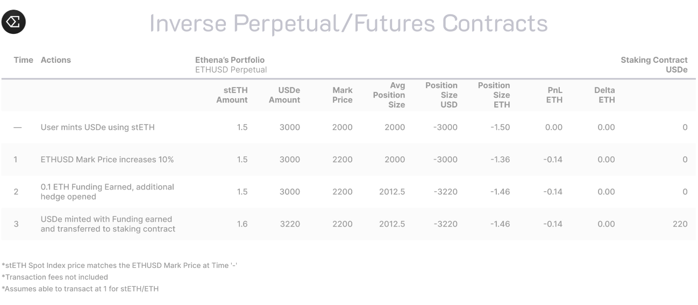
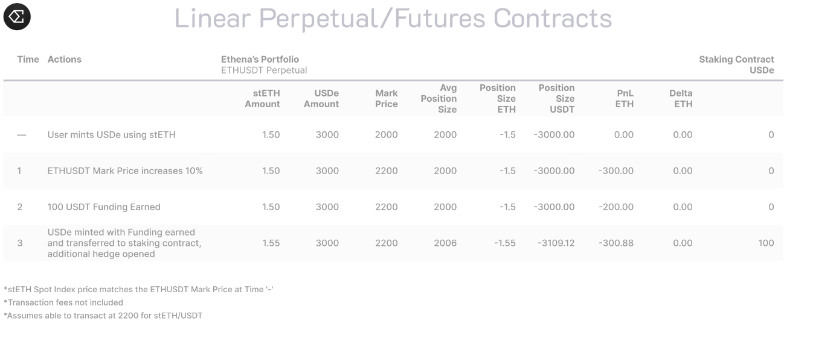

Ethena enables the creation and redemption of a delta-neutral synthetic dollar, *USDe*,

The mechanism backing *USDe* enables sUSDe, the first "Internet Bond" offering a crypto-native, reward-accruing asset, derived from staked asset returns (to the extent utilized in backing) and the funding and basis spread available in perpetual and futures markets.

> Warning: this article is still in draft state and its content is still mainly taken from the documentation with a few edits of my own. Its content should become more personal later.

[TOC]

## Peg Stability Mechanism

*USDe* derives its relative peg stability from executing automated and programmatic delta-neutral hedges with respect to the underlying backing assets. 

Hedging the price change risk of the backing asset in the same size minimizes fluctuations in the backing asset price as the change in value of the collateral asset is generally offset by the change in value of the hedge. 

Ethena does not use any material leverage to margin the delta hedging derivatives positions beyond the natural state as a result of exchanges applying slight discounts to the value of backing assets to the extent used as backing and margin collateral on the initial hedge and issuance of *USDe*. 

#### Key Information

1. Users are able to acquire USDe in permissionless external liquidity pools.
2. Approved parties from permitted jurisdictions who pass KYC/KYB screening are able to **mint** & **redeem** *USDe* on-demand with Ethena contracts directly following whitelisting. See Supplemental USDe Terms and Conditions.
3. There is minimal reliance upon traditional banking infrastructure as trustless backing assets are held and stored within the crypto ecosystem. 

#### **Mechanic Example**

1. A whitelisted user provides ~$100 of *stETH* and receives ~100 newly-minted *USDe* atomically in return less the gas & execution costs to execute the hedge.
2. Slippage & execution fees are included in the price when **minting** & **redeeming**. Ethena earns no profit from the **minting** or **redeeming of** *USDe*.
3. The protocol opens a corresponding short perpetual position for the approximate same notional dollar value on a derivatives exchange.
4. The backing assets are transferred directly to an "Off Exchange Settlement" solution. Backing assets remain onchain and custodied by off exchange service providers to minimize counterparty risk. 
5. Ethena delegates, but never transfers custody of, backing assets to derivatives exchanges to margin the short perpetual hedging positions.

## Generated Revenue

The Ethena protocol generates two sustainable sources of revenue from the backing assets. 

The protocol revenue is derived from:

1. Staked ETH assets receiving consensus and execution layer rewards.
2. The funding and basis spread from the delta hedging derivatives positions.

Revenue from staked assets is floating by nature and denominated in the native asset - for example, liquid staked ETH tokens are typically denominated in *ETH*. 

The funding and basis spread can be floating or fixed depending upon if the protocol uses non-deliverable or deliverable derivatives positions to hedge the backing asset delta.

The funding and basis spread has historically generated a positive return given the mismatch in demand and supply for leverage in crypto as well as the existence of positive baseline funding.  

### Negative funding rate

If funding rates are deeply negative for a sustained period of time, such that the staked asset revenue cannot cover the funding and basis spread cost, the Ethena "reserve fund" is designed to bear the cost.

[Learn more about the protocol revenue.](https://docs.ethena.fi/solution-overview/protocol-revenue-explanation)

## Risks

The protocol is exposed to [various risks](https://docs.ethena.fi/solution-overview/risks) including but not limited to:

1. Smart Contract Risk
2. External Platform Risk
3. Liquidity Risk
4. Custodial Operational Risk
5. Exchange Counterparty Risk
6. Market Risk

Ethena recognizes these risks and actively attempts to ameliorate & diversify these risks as much as possible. In practice, this means the system uses multiple providers for each step of the workflow and actively monitors all partners and market conditions. 

Every element of the Ethena design has been formulated with risk mitigation in mind including the use of custodians, absence of material leverage, and diversification constraints on the hedging positions

Please refer to the [*USDe* Risk](https://docs.ethena.fi/solution-overview/risks) section for more information.

## Delta-Neutral Stability

### What is "delta"?

"Delta" refers to the sensitivity of the derivatives contract to a change in the price of the underlying asset. 

By way of example, if Ethena did not execute a hedge with respect to 1 ETH transferred by a minter upon mint of USDe, the backing of *USDe* would have a positive delta of 1 ETH. As a result, the USD value (and, by extension, *USDe* backing value) of the 1 ETH would change equally with the change in the spot market price of ETH.

Read more: [Introduction to Option Greeks](https://insights.deribit.com/education/introduction-to-option-greeks/)

### What is delta-neutral stability?

A portfolio can be considered to be "delta-neutral" if it has a delta of `0`. 

This means the portfolio is NOT exposed to the price change in the underlying value of the asset.

Following on from the example above, where Ethena naturally has a positive delta of 1 *ETH* from a user providing 1 *ETH* of backing, if Ethena hedges 1 *ETH* worth of delta by going short a perpetual contract with a nominal position size equal to that 1 *ETH*, the delta of Ethena's portfolio is 0.

Said differently. when a portfolio is delta-neutral, the value in USD terms remains constant regardless of market conditions (ie regardless of any change in the spot price of *ETH*). The price of *ETH* could triple and then fall by 90% one second after another & the USD value of the portfolio would remain unaffected (outside of momentary dislocations between spot and derivatives markets). This is because the profits from the 1 *ETH* tripling in price are perfectly offset by losses from the equal-in-size short perpetual position.  [Here is a worked example of a portfolio being delta-neutral.](https://docs.ethena.fi/solution-overview/usde-overview/delta-neutral-examples)

Ethena trades with no effective leverage across exchanges as the delta offsetting short perpetual positions are equal in size to the backing assets.

To note, many institutional market makers remain delta-neutral to avoid profits/losses from price volatility and this is a very familiar concept across both traditional finance & digital assets.

# Delta-Neutral Examples

## Context

*Based on Arthur Hayes' example in his article:* [*Dust on Crust*](https://blog.bitmex.com/dust-on-crust/)

*Here, we have used an inverse perpetual to explain the different payoff scenarios of a delta-neutral strategy. Ethena will utilize both inverse and linear perpetuals. The payoff outcomes on an inverse perpetual are more intricate and as a result, we focus on explaining those scenarios below.*

An Ethereum inverse perpetual which is worth $1 of Ethereum paid out in Ethereum has the following payoff function:

*$1 / Ethereum Price in USD*

If Ethereum is worth $1, then the Ethereum value of the perpetual is 1 *ETH*, $1 / $1.

If Ethereum is worth $0.5, then the Ethereum value of the perpetual is 2 *ETH*, $1 / $0.5.

If Ethereum is worth $2, then the Ethereum value of the perpetual is 0.5 *ETH*, $1 / $2.

------

## Worked Examples

1 *USDe* = $1 of *ETH* + Short 1 Ethereum / USD Inverse Perpetual

To create 1 *USDe*, Ethena needs to delegate 1 *ETH* as margin with a derivatives exchange (via "Off-Exchange Settlement" solution) and short 1 ETHUSD perpetual.

#### Rapid ETH Price Decrease

- Now the Ethereum price falls from $1 to $0.1.
- The value of ETHUSD in ETH = $1 / $0.1 = 10 *ETH*
- The PNL of ETHUSD Position = 10 *ETH* (current value) – 1 *ETH* (initial value) = +9 *ETH* 
- We have 1 *ETH* delegated as margin with the exchange.
- Ethena's total equity balance with the exchange is 1 *ETH* (our initial margin) + 9 *ETH (*profit from the ETHUSD position), and the total balance is now 10 ETH. 
- The Ethereum price is now $0.1, but the system has 10 *ETH*, and therefore the USD value of the total portfolio is **unchanged** at $1, $0.1 * 10 *ETH*.

#### Rapid ETH Price Increase

- Now the Ethereum price rises from $1 to $100.
- The value of ETHUSD in *ETH* = $1 / $100 = 0.01 *ETH*
- The PNL of ETHUSD Position = 0.01 *ETH* (current value) – 1 *ETH* (initial value) = -0.99 *ETH*
- Ethena's total equity balance with the exchange is 1 *ETH* (initial margin) – 0.99 *ETH* (loss from ETHUSD position), and total balance is now 0.01 *ETH*. 
- The Ethereum price is now $100, but Ethena has 0.01 *ETH*, and therefore the USD value of the total portfolio is **unchanged** at $1, $100 * 0.01 *ETH*.

Delta-neutral strategies aim to ensure the portfolio value in synthetic USD terms is **unchanged** despite changes in value of the underlying collateral. In certain conditions and market environments this may not hold, as is described in more detail in the Risks section.

------

## Further Worked Examples

# Scalability

### How *USDe* enables scalability

1. **Backing Ratio**

*USDe* is backed at a 1:1 ratio thanks to a delta-neutral strategy, where short BTC & *ETH* futures positions offset any changes in value to the underlying collateral. 

The result is the most capital-efficient synthetic dollar in the industry. 

Other onchain overcollateralized "stablecoins" tend to run minimum collateral ratios of ~150%, with some even higher, requiring more capital to be locked up than the stablecoin it mints. Effective overcollateralization is often over 200%.

While this approach is a good way to ensure stability when using decentralized collateral, the capital inefficiency of doing so means that the stablecoin cannot scale into the billions without taking on more centralized collateral, as we have seen with the proliferation of onchain RWAs. This opens up censorship risk and essentially makes the stablecoin a wrapper for U.S Treasuries. The only way to ensure capital efficiency and relative stability using decentralized collateral is to delta hedge any price exposure on trustless crypto collateral.

1. **CeFi Liquidity**

Unfortunately, decentralized perpetual liquidity isn’t sufficient to allow Ethena to achieve its goal of scaling *USDe* into the billions. Projects like UXD have tried to solely use decentralized exchanges, but the lack of liquidity severely limited their ability to scale, while others have fallen victim to hacks and exploits of the decentralized exchanges. 

With >25x the open interest on perpetual futures on centralized exchanges, a synthetic USD asset that leverages that liquidity has the ability to scale exponentially larger than would be possible on just decentralized exchanges living purely onchain. 

1. **Scalable Collateral Base**

The consensus view among Ethereum researchers and the ecosystem is that 40% of *ETH* supply staked is a very realistic near-term goal, with 27% of *ETH* supply staked currently (as of April 2024). 

At current prices that’s an extra ~$50bn of staked ETH growth, on top of an already impressive total of ~$110bn today. There is more than sufficient liquid staking token ("LST") collateral available to be used to mint *USDe* & for *USDe* to scale into the tens of billions using ETH alone.

In order to scale the product even further, Ethena uses *BTC* and will use other non-*ETH* assets as collateral in the future. Ethena is build to support any crypto asset with a sufficiently liquid derivatives market.

Currently, *BTC* funding rates closely mirror *ETH’s*, with funding being paid to the short side in the range of 7-9% annually on average.

# Censorship Resistance

### How *USDe furthers* censorship resistance

Assets backing USDe remain in "Off-Exchange Settlement" institutional grade solutions at all times. The only time collateral flows between custody and exchange is to settle funding or realized P&L.

Ethena utilizes "Off-Exchange Settlement" (OES) providers to hold backing assets. This enables Ethena to delegate/undelegate collateral to centralized exchanges without being exposed to exchange-specific idiosyncratic risk.

While using an OES provider requires a technological dependence upon the OES provider, it does NOT mean counterparty risk has simply been transferred from the exchange to the OES provider. OES providers typically, where not using an MPC solution, employ a bankruptcy-remote trust framework to ensure the OES provider's creditors have no claim to the assets. In the case of an OES provider failing, these assets are expected to be outside the provider's estate and not exposed to the credit risk of the custodian.

All supported OES providers are non-US-based. This offers a unique risk profile versus custodying funds with an exchange or holding fiat or treasury bonds in a US bank account or with a US based custodian. Treasury bonds and even stablecoins holding said treasuries present significant censorship risk.  Note: Due to the current regulatory environment in the US, and with a strong focus on global regulatory compliance, we have chosen not to work with US-based service providers at this time.  

In summary, while the use of OES providers may be viewed as more centralized vs fully onchain solutions, they represent very different censorship risk profiles than onchain stablecoins holding U.S Treasuries in a US bank account, or the opaque risk of holding assets on a centralized exchange.  Empirically, Ethena's integrated providers for custody services have never lost a dollar of users funds compared to the $7bn lost in DeFi hacks, and >$15bn in CeFi insitutions last cycle.

# Regulatory Compliance

As of 29 July 2024 Ethena GmbH, a wholly-owned subsidiary of Ethena Labs, submitted an application for authorization to make an offer to the public of an asset-referenced token pursuant to Art. 16 et seq. of Regulation (EU) 2023/1114 ("MiCAR") with Bundesanstalt für Finanzdienstleistungsaufsicht (“BaFin”) with respect to USDe. BaFin has significant experience and expertise with respect to crypto assets and we look forward to a collaborative process. As the application was submitted prior to the 30 July 2024 deadline, it is expected that the MiCAR grandfathering provisions with respect to the ongoing issuance of USDe apply (see Art. 143 para. 4 MiCAR). Updates will be provided publicly as appropriate as the authorization process proceeds according to the provisions of MiCAR. Please refer to the Supplemental USDe Terms and Conditions located at https://ethena-labs.gitbook.io/ethena-labs/resources/supplemental-usde-terms-and-conditions.

# Peg Arbitrage Mechanism

There is one presently available trade strategy available to users to profit from a price dislocation of *USDe* in external markets from what it is actually worth:

**Cross Market Arbitrage:** purchasing or selling USDe into the protocol mint & redeem contract when USDe price has diverged from $1.

## Trade Strategies

It's important to keep in mind:

- *USDe* is backed strictly by the protocol backing assets. 
- *USDe* is able to be **minted** & **redeemed** on demand by authorized, whitelisted users. This means that at any time, approved users are able to ramp in & out.
  - about 0.50% of backing assets are typically held in stablecoin form and available in the Minting Smart Contract to enable on-demand redemptions. This balance is systematically replenished from the 4% of the backing assets of *USDe* held in stablecoins that are readily available from multiple custodians.
- The value & amount of *USDe's* underlying backing is generally unaffected by any dislocations or rapid movements of price across any Centralized/Decentralized Spot Market, AMM Protocols, etc., though fluctuations in those markets may cause temporary dislocations in the secondary market price of *USDe* as the market's "reference assets" for the target peg.
- The value of the reserve underpinning *USDe* is generally unaffected by the removal of liquidity in volatile markets.

### 1. Cross Market Arbitrage

This strategy enables any user approved to mint/redeem to profit from the difference between the price/amount users' are able to **mint**/**redeem** *USDe* with Ethena & the value of *USDe* in an external market. An external market includes all centralized & decentralized spot markets such as "USDe/USDC" and AMM Protocols such as Uniswap or Curve. 

If *USDe* is worth **LESS** in an external market than from Ethena directly, a user could:

1. Buy 1x *USDe* at 0.95 from Curve using *USDT*.
2. Redeem 1x *USDe* at 1.00 from Ethena receiving *USDT*.
3. Profit.

If *USDe* is worth **MORE** in an external market than from Ethena Labs, a user could:

1. Mint *USDe* using *USDT* from Ethena.
2. Sell the *USDe* in the Curve pool for > 1.00 for *USDT*.
3. Profit.

# Risks

Synthetic dollar vs fiat and RWA backed stablecoins

## Existing Fiat and RWA Stablecoins

Centralized stablecoins, such as *USDC* or *USDT*, provide stability and capital efficiency, but they introduce: 

- Unhedgeable custodial risk with bond collateral in regulated bank accounts which are prone to censorship.
- A critical reliance upon the existing traditional banking infrastructure and country-specific evolving regulations.
- A "return-free risk" for the user as the issuer internalizes the yield whilst exporting the risk of the depeg to users' holding the fiat stablecoin.
- Represent an unsecured credit position to both the issuer and underlying bank holding the collateral assets while mixing these assets with other bank lending activities eg Silicon Valley Bank.

Other centralized stablecoins that use "Real World Assets" (RWAs) as the collateral backing & distribute the yield face the same confiscation & censorship risk.

Fiat or RWA-backed Stablecoins are critically reliant upon the traditional banking infrastructure & regulatory environment to enable "mint" & "redeem" requests, ensuring the peg. As with *USDC* during the Silicon Valley Bank run, the value of the fiat-backed stablecoin depegged for a few days given the inability of Circle to facilitate "mint" & "redeem" requests. In essence, just because a stablecoin is backed by fiat or RWAs, it doesn't guarantee peg stability in all circumstances.

## Risks of *USDe* as Synthetic Dollar

Ethena is committed to transparency. It is crucial to highlight the risks associated with *USDe,* the actions taken to mitigate these risks, as well as plans to further manage and ameliorate these risks.

This section will discuss the following risks:

1. [Funding Risk](https://docs.ethena.fi/solution-overview/risks/funding-risk)
2. [Liquidation Risk](https://docs.ethena.fi/solution-overview/risks/liquidation-risk)
3. [Custodial Risk](https://docs.ethena.fi/solution-overview/risks/custodial-risk)
4. [Exchange Failure Risk](https://docs.ethena.fi/solution-overview/risks/exchange-failure-risk)
5. [Collateral Risk](https://docs.ethena.fi/solution-overview/risks/collateral-risk)

We would greatly appreciate any feedback or information you would like to see to help the protocol be as transparent as possible. If you believe any risk has not been adequately surfaced please reach out in Discord and notify the contributors.

# Funding Risk

## Context

Given Ethena uses derivatives positions, such as perpetual contracts, to hedge the delta of the digital asset collateral, the protocol is exposed to "Funding Risk".

"Funding Risk" relates to the potential of persistently negative funding rates. Ethena is able to earn revenue from funding, but could also be required to pay funding. 

While this is a direct risk to the protocol revenue and backing, the data presented below demonstrates that negative funding periods tend not to persist and revert to a positive mean.

Negative funding rates are a feature, rather than a bug of the system. USDe has been built with this in mind.

We acknowledge that historical data before Ethena's launch does not reflect Ethena's impact on the market. We are monitoring updated funding rate dynamics and will provide updates to this section as we collect the new data.

## How Ethena manages Funding Risk

An Ethena reserve fund exists and will step in on occasions when the combined revenue between LST assets*,* such as *stETH*, and the funding rate for a short perpetual position, is negative. This seeks to protect the spot backing underpinning *USDe*. Ethena does not pass on any "negative revenue" to users who stake *USDe* for *sUSDe*.

### **Positive Bias**

*ETH* funding rates have exhibited natural positive bias and contango, with an average annualized rate of between 6% - 8% over the last 3 years on an open interest or volume-weighted basis, including the 2022 bear market.

# Liquidation Risk

## Context

While Ethena currently uses spot ETH and BTC as collateral for short derivatives positions, Ethena uses a certain amount of staked Ethereum spot assets as collateral as well (10% as of July 2024).

As a result of the protocol sometimes using a different asset than the underlying (ETH or BTC) of the derivatives positions, and exchange partners operating on a "No Loss" principle, exchanges retain the discretion to forcibly close positions when there is a considerable difference in value between the two assets. 

This is called "Liquidation" across the space and only occurs when a user no longer has sufficient collateral to meet the margin requirements of the position. In this context, this is the "Liquidation Risk" being referred to.

This section aims to demonstrate how unlikely a liquidation event is, considering Ethena uses very minimal leverage. Further, at present, the composition of backing assets includes comparatively low amounts of LSTs. However, we felt it was necessary to address the possibility of liquidation and make users familiar with the extreme circumstances that would lead to such an event.

## Overview

At a high level, exchanges' risk engines ensure each user has sufficient collateral, or "Maintenance Margin", to margin existing positions. Many exchanges now offer incremental liquidation as to reduce the cost to the user & the exchange, where a position is slowly closed vs immediately in-full.

Ethena's backing is principally dependent upon the spread between the value of protocol backing assets & the price of the short derivatives positions not diverging in a problematic manner.

## Spread

Given the importance to the protocol of the value of the staked Ethereum collateral trading in line with *ETH*, it's worth sharing historical data for context.

# Custodial Risk

## Context

Given that Ethena relies upon "Off-Exchange Settlement" provider solutions to hold protocol backing assets, there is a dependence upon their operational ability. This is the "Custodial Risk" we are referring to.

Counterparty risk is a prevalent issue throughout crypto and has never been more important than it is today. The custodians' business models are built on the safeguarding of assets, vs. the alternative of leaving collateral sitting on a centralized exchange.

## Overview

There are three principal risks with using an Off-Exchange Settlement provider for custody:

1. **Accessibility and Availability.** Ethena’s ability to deposit, withdraw, and delegate to & from exchanges. Any of these abilities being unavailable or degraded would impede the trading workflows & availability of the **mint**/**redeem** *USDe* functionality.
   - It is important to note that this should NOT affect the value of the backing underpinning *USDe*.
2. **Performance of Operational Duties.** In the event of an exchange failure, the protocol is reliant upon cooperation and reasonable legal behaviour to facilitate the expedient transfer of any unrealized PnL at risk with an exchange. Ethena mitigates this risk by settling PnL with exchanges frequently to avoid large balances being owed to the protocol.
   - For example, Copper's Clearloop settles PnL between exchange partners and Ethena daily.
3. **Operational Failure of Custodian.** While the core team is not aware of any material operational failures or insolvencies for large-scale crypto custodians, this does remain a possibility. While assets are held in segregated accounts, insolvency of a custodian would pose operational issues for the creation and redemption of *USDe* as Ethena manages the transfer of assets to alternative providers.
   - Backing assets within these solutions are not owned by the custodian nor is the custodian or its creditors expected to have a legal claim on the assets. This is a result of OES providers either utilizing bankruptcy-remote trusts or MPC wallet solutions.

These three risks are mitigated by Ethena not exposing too much collateral to a single OES provider and ensuring concentration risk is managed. It’s important to keep in mind that the system strives to use multiple OES providers with the same exchanges to mitigate both of the aforementioned risks.

## Example: Copper Clearloop

Individual custodial providers also provide the following protection, using Copper's Clearloop as an example:

- Copper has never been hacked or lost users’ funds in contrast to the $7bn lost in DeFi.
- Copper users’ funds were wholly available within days of Coinflex’s (exchange) failure.
- Copper users’ funds are a part of a bankruptcy-remote trust, meaning in the event of Copper’s failure, users’ funds are not a part of the Copper estate.
- Exchanges post collateral with Copper ahead of time to ensure users’ PnL is settled each cycle. This enables Copper to ensure users receive their PnL even if an exchange refuses to settle.
- Ethena retains the ability to dispute erroneous exchange settlement requests.

For more information, please refer to Copper's one-pager on Clearloop:

# Exchange Failure Risk

## Context

Ethena utilizes derivatives positions to offset the delta of the protocol backing assets. These derivatives positions are traded upon CeFi exchanges such as Binance, Bybit, Bitget, Deribit, and Okx. As such, in the event an exchange were to suddenly become unavailable such as FTX, Ethena would need to manage the consequences. This is the "Exchange Failure Risk" we are referring to.

Protocol backing is NEVER deposited to exchanges and always resides with "Off Exchange Settlement" providers. Ethena has made significant efforts to minimize exposure to exchange failures.

## What happens in the event of a failure of an exchange?

Ethena retains complete control and ownership of the assets via Off-Exchange Settlement providers with no collateral ever being deposited with any exchange. This limits Ethena's exposure to idiosyncratic events on any one exchange to the outstanding PnL between Off-Exchange Settlement providers' settlement cycles.

> Copper's Clearloop runs a settlement cycle daily.

As such, in the event of an exchange failure, Ethena would delegate the collateral to another exchange and hedge the outstanding delta that was previously covered by the failed exchange. In the event of an exchange failure, the derivatives positions are considered closed with Ethena holding/owing no further obligation to the exchange estate.

Capital preservation is front of mind for Ethena. In the event of extreme circumstances, Ethena will always work to protect the value of the collateral & *USDe* stable peg.

## How is the exchange failure risk managed?

As with all parts of Ethena' workflows, Ethena is agnostic to each provider at each step of the workflow. 

- Ethena diversifies the risk and mitigates the potential impact of exchange failure by utilizing multiple exchanges.
- Ethena is continually integrating with new sources of liquidity in an effort to limit the protocol's exposure to each source.
- Ethena actively monitors the ecosystem with investors, advisors, and friends across the industry, taking a proactive approach to de-risking exchange exposure if associated risks are perceived to have changed.

### Worked Example: Exchange Failure

Below we have laid out a scenario when spot prices fall 20% in the event of an exchange failure, and for different levels of *USDe* supply, how much profit from our short position would be left on that exchange that fails. This profit would hypothetically be tied up in an exchange failure on that day and owed to Ethena, while the spot value of our collateral falls in value.

Ethena's risk controls will aim to ensure our concentration per exchange is close to the distribution of open interest across the market. 

Using open interest figures as of October 2023, each exchange's market share is listed below for a total of $5.15bn of ETH open interest:

# Collateral Risk

## **Context**

Given Ethena uses some *stETH* and other LSTs in part to margin the delta hedging derivatives positions, the integrity and confidence in those assets is paramount. "Collateral Risk" in this context refers to the fact that a backing asset for USDe (stETH) differs to the underlying asset of the perpetual futures position (ETH).

Ethena is agnostic to Ethereum LSTs. While *stETH* market share initially looked to be winning in a winner's take-all market, its market share has dramatically been reduced by other assets such as Mantle's *mETH*.

As in these cases the backing asset, *ETH LSTs*, is different to the underlying asset of the hedging contracts, *ETH*, Ethena needs to ensure the price difference between those two assets is as small as possible. This is accomplished by supporting LST assets with the least chance of depegging and broad industry support.

As discussed in the [liquidation risk](https://docs.ethena.fi/solution-overview/risks/liquidation-risk) section, due to low leverage and tighter collateral haircuts, the impact of a stETH depeg is minimal to hedged positions and the possibility of liquidation is extremely unlikely. 

## Overview

Therefore there are two functional risks that are front of mind:

1. Staking / Unstaking from ETH <-> LST
2. Loss of confidence in the integrity of the LST

### **1.** Staking / Unstaking from ETH <-> LST

Users' ability to stake *ETH* with Lido and to receive 1:1 *stETH*:*ETH* ensures the price of the two assets do NOT typically diverge. Prices between *stETH:ETH* could begin to slightly diverge if there is a greater demand to stake/unstake *ETH*/*stETH* than available either via the Lido exit queue or external markets enabling swaps (Curve, Bybit, etc).

At this point in time, all protocols reliant on *stETH (*and any *ETH* LST), accept this liquidity risk profile. This means the amount of *stETH* that can be unstaked with Lido might be subject to delay or the user may have to accept a slight discount if required to trade immediately in external markets.

Approved users of Ethena are able to **redeem** *USDe* for *stETH* (or any *ETH* LST) at any time on-demand or request an alternate asset and tap Ethena's ability to access multiple pools of liquidity.

The *stETH*-*ETH* Curve pool is the most liquid source of onchain liquidity for *stETH* with a TVL of $200m as of October 2023. Any user is able to swap *stETH* <-> *ETH* if they do not wish to wait for the Lido *stETH* validator exit queue.