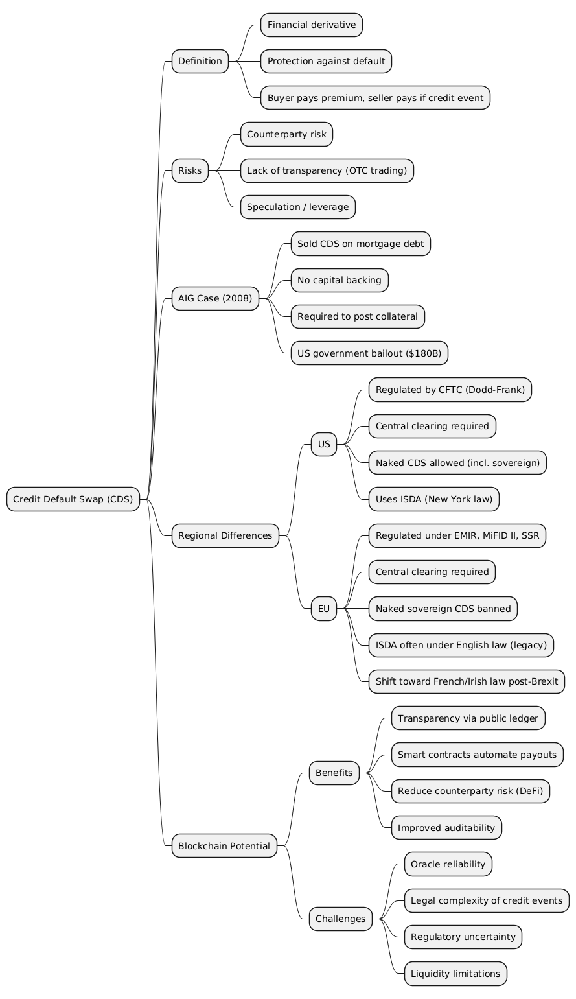

# GMX

## Schema

### Introduction

> What is the primary function of the GMX V2 protocol within the DeFi ecosystem?

Serving as a decentralized perpetual exchange

> In the context of perpetual exchanges like GMX V2, what fundamental mechanism helps anchor the perpetual contract price to the underlying asset's index price?

Funding Fees

> What is a primary benefit of using the `multicall` pattern, frequently employed in interactions with protocols like GMX V2?

It allows multiple actions to be bundled into a single, atomic transaction.

> What is the primary purpose of using a 'bridge' to move assets between different blockchain networks, such as from a Layer 1 to a Layer 2?

To make the assets usable for transactions or interactions on the destination network.

> What term describes the process of transferring assets like ETH between the Ethereum mainnet (Layer 1) and Arbitrum One (Layer 2)?

Bridging

> After successfully bridging 0.1 ETH from Ethereum to Arbitrum One, what change would you expect to see in your Ethereum wallet balance?

A decrease of slightly more than 0.1 ETH due to the bridged amount and L1 gas fees.

### Foundation

> What is the main function of adaptive funding fees in perpetual contract markets?

To incentivize convergence between the contract's trading price and the underlying asset's index price.

> What primary function does the GMX platform serve in the decentralized finance (DeFi) ecosystem?

It operates as a decentralized exchange allowing users to trade perpetual contracts with self-custody.

> When opening a 'long' position on a perpetual contracts platform like GMX, what is the trader anticipating?

An increase in the price of the underlying asset.

> In GMX V2's liquidity provision system, what distinguishes a GM Pool from a GLV Vault?

GM Pools are tied to a single trading market, whereas GLV Vaults aggregate liquidity across multiple markets.

> What is the main benefit GMX seeks by utilizing a two-step process (request transaction followed by execution transaction) for user actions?
>
> 

To protect users against Maximal Extractable Value (MEV), particularly front-running attempts.

> What role does the 'adaptive' funding fee play in perpetual contract markets like GMX?

It helps keep the contract price aligned with the underlying asset's index price by incentivizing trades that balance long and short open interest.

> What is a common mechanism used in perpetual swap protocols to incentivize a balance between long and short open interest?

Periodic fee payments (funding fees) exchanged between holders of long and short positions based on the imbalance.

> In the GMX V2 protocol, what is the primary function of Liquidity Providers (LPs)?

Supplying assets to the GM pool to enable trading and serve as the counterparty.

> How are user actions, such as trades or liquidity deposits, finalized on the blockchain within the GMX V2 system?

Through a two-step process: the user creates an order request, and then an authorized Keeper executes it.

> Which type of fee within the GMX V2 protocol is specifically designated to compensate Keepers for the computational cost and service of finalizing user orders?

Execution Fee

> What critical role do Keepers play concerning market data when executing orders in GMX V2?

They submit current oracle prices for relevant assets within the same transaction that executes a user's order.

> How are profits and losses handled between Traders and the GM pool (Liquidity Providers) in GMX V2?

Trader profits are paid from the GM pool's liquidity, while trader losses are deducted from the trader's collateral, effectively remaining in the pool.

> Under what condition does a trader typically realize a profit from a perpetual swap position?

When the market price of the underlying asset moves in the direction the trader predicted.

> What is the fundamental role of collateral when trading perpetual swaps?

To serve as a security deposit to cover potential trading losses.

> The term 'perpetual' in 'perpetual swaps' refers to which characteristic of these financial instruments?

They do not have a set expiration or settlement date.

> What event triggers the liquidation (forced closure) of a perpetual swap position?

The trader's unrealized losses growing to nearly the full amount of their deposited collateral.

> How is the Profit/Loss (P/L) calculated for a long position in a trading scenario?

Closing Price minus Opening Price

> How is the Profit/Loss (P/L) calculated for a short position?

Opening Price minus Closing Price