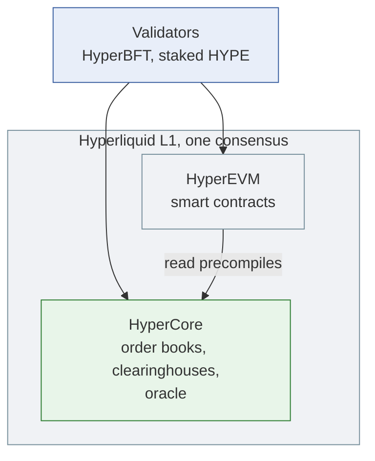
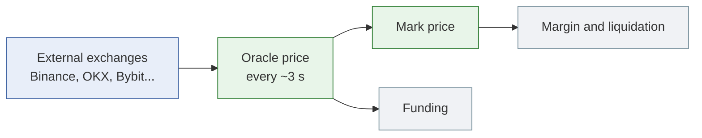
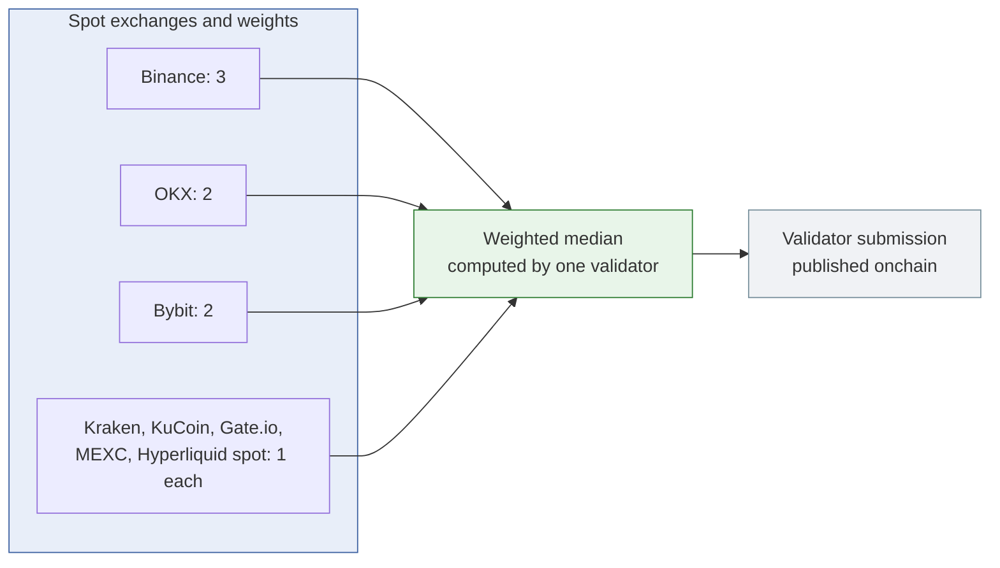
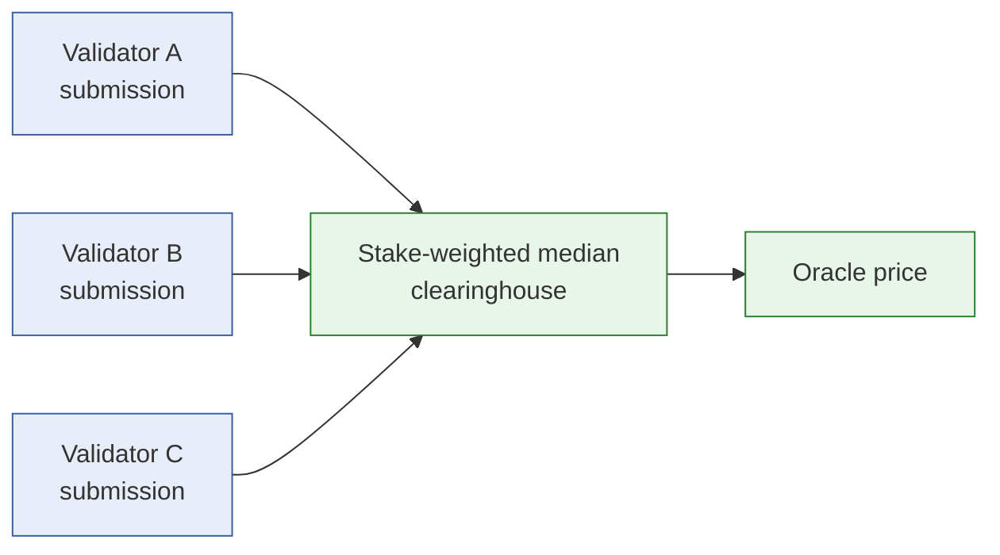
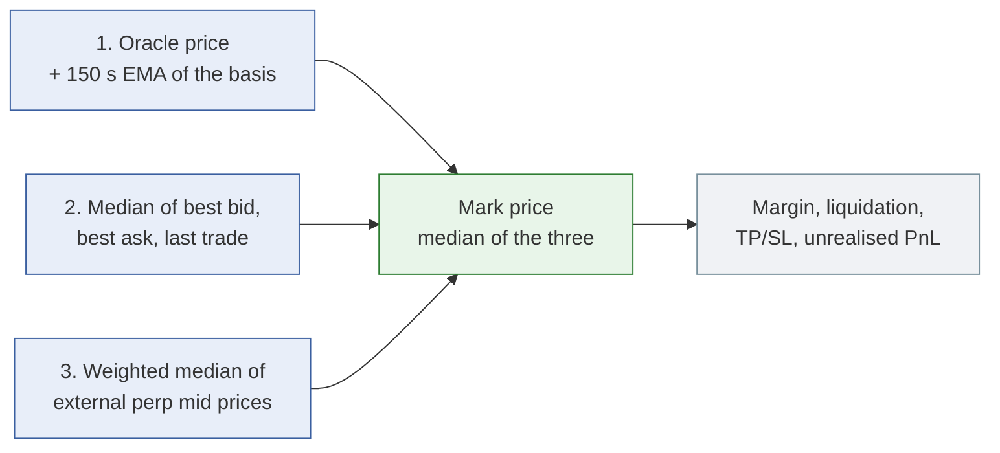
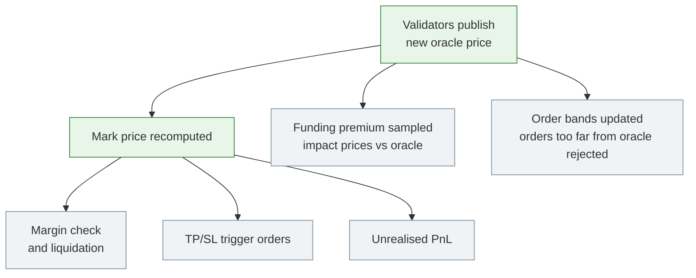
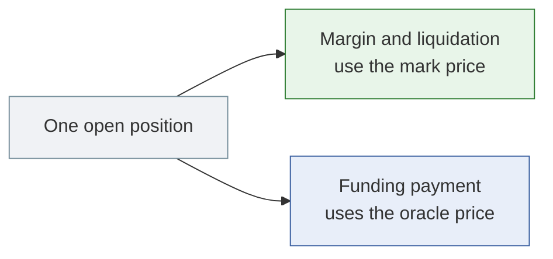
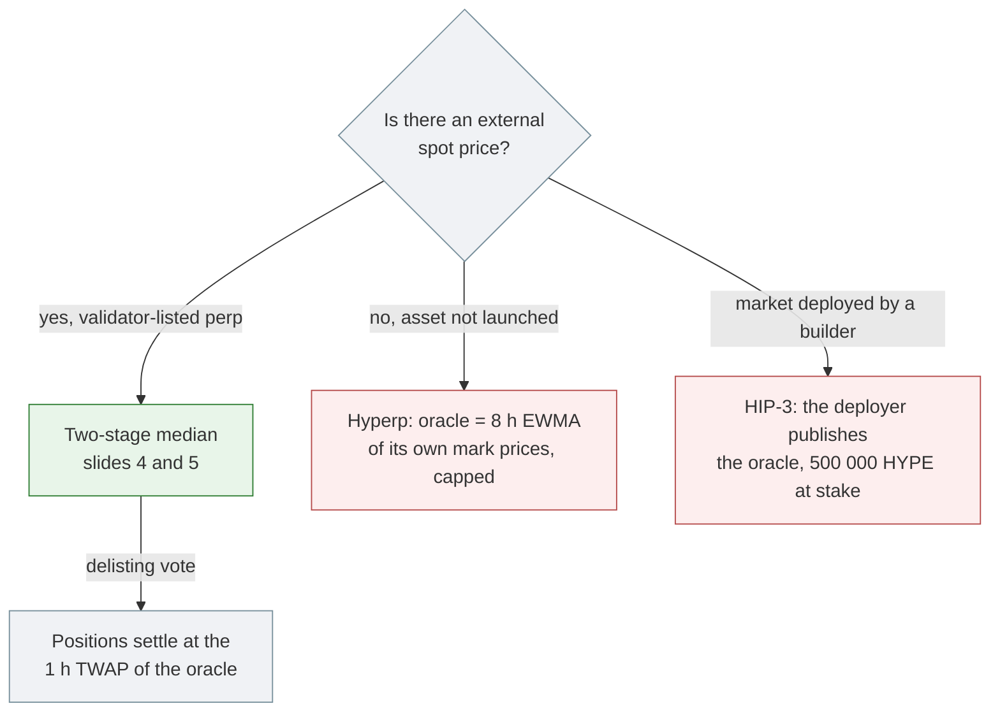
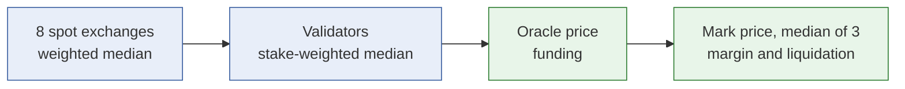

# How the Hyperliquid Oracle Works

**From validator medians to mark price, funding and liquidation**

Ryan Sauge · v1.0 · 2026-10-01

Talk length: about 5.5 minutes (11 slides, 20 to 40 seconds each)

Source: [The Hyperliquid Oracle](https://rya-sge.github.io/access-denied/2026/09/02/hyperliquid-oracle-mark-price/) and the [Hyperliquid documentation](https://hyperliquid.gitbook.io/hyperliquid-docs/hypercore/oracle)

---

## 1. What is Hyperliquid

- A proof-of-stake L1 built for trading, secured by HyperBFT (a HotStuff variant), with HYPE as its staking token.
- The order book, margin engine and liquidations are onchain state that validators agree on. No off-chain matching, no AMM.
- A general-purpose EVM (HyperEVM) runs inside the same consensus. There is no bridge between the two.

> **Speaker notes (30 s):** The main product is perpetual futures. Mainnet handles roughly 200 000 orders per second, with a median latency of 0.2 s for a co-located client. The oracle we look at today lives in HyperCore, the green box, and the validators publish it.

---

## 2. Why: a liquidation without a trade

- On Hyperliquid, a position can be liquidated at a price that no trade on Hyperliquid printed.
- The protocol keeps several prices. Each one drives a different part of the system.
- Underneath all of them: one oracle, published by the validators every 3 seconds.

> **Speaker notes (30 s):** Start with the surprise. Traders see a liquidation and look for the trade that caused it on the book. Often there is none. The rest of the talk explains which price decided it and where that price comes from.

---

## 3. Four prices, four jobs

| Price | Built from | Used for |
|---|---|---|
| Oracle price | External spot exchanges, aggregated by validators | Funding |
| Mark price | Median of three indices, one is the oracle | Margin, liquidation, TP/SL, unrealised PnL |
| Impact bid / ask | Hyperliquid's own order book | Funding premium |
| Borrow oracle price | Oracle price of the collateral | Portfolio margin |

- Funding should pull the perp toward spot, so it uses a price that ignores Hyperliquid's book.
- Margin should price the contract itself, so it uses a price that includes the book.

> **Speaker notes (35 s):** Most confusion comes from mixing up the first two rows. Keep this table in mind: the next slides build the oracle price first, then the mark price.

---

## 4. The oracle price: stage one, inside each validator

- Every ~3 seconds, each validator computes a **weighted median** of spot mid prices from 8 exchanges.
- Weights sum to 12. No exchange holds more than 3.
- A median, not a mean: one exchange printing a wrong price changes nothing until enough weight moves with it.

> **Speaker notes (35 s):** The list depends on the asset. BTC excludes Hyperliquid spot, because its liquidity is elsewhere. HYPE excludes external exchanges, because its liquidity is on Hyperliquid. A venue that barely trades the asset only adds something to manipulate.

---

## 5. The oracle price: stage two, across validators

- The clearinghouse takes the **stake-weighted median** of all validator submissions.
- Two medians in series: one over exchanges, one over validators.

To move the price, an attacker must move a weighted majority of exchanges **and** a stake majority of validators.

> **Speaker notes (30 s):** The oracle adds no trust assumption beyond HyperBFT consensus, and removes none. If a stake majority colludes, the oracle is wrong, but so is everything else on the chain.

---

## 6. The mark price: a median of three indices

The oracle is a spot price. A perp trades at a basis to spot, so margin uses a separate mark price.

- A wick on Hyperliquid's book moves index 2 only. The median holds.
- This answers slide 2: two external indices moving is enough to liquidate, with no trade on the local book.

> **Speaker notes (35 s):** The exchange median protects against one bad exchange. This median protects against a whole class of price going wrong: the local book, external spot, or external perps. If only two indices are available, a 30-second EMA of the second one is added as a fourth.

---

## 7. What one tick sets in motion

- Order matching does not use the oracle. Everything priced against the outside world does.

> **Speaker notes (30 s):** Three seconds sounds slow next to a matching engine, but matching uses the book. The oracle also limits what can be placed on the book: an order priced too far from it is rejected with the `Oracle` error.

---

## 8. Funding: margined at one price, charged at another

- Funding premium: impact bid and ask (average fill price for 20 000 USDC on BTC/ETH, 6 000 USDC elsewhere) against the **oracle**.
- Premium is zero when the oracle sits between the impact bid and ask.
- Payment each hour: `position size × oracle price × funding rate`.

> **Speaker notes (30 s):** Impact prices instead of top of book: one small quote far from the oracle cannot create a premium. During a dislocation, the gap between the two prices a trader sees is not small.

---

## 9. When there is no external price

- Hyperp: circular by design. Mark capped at 3× the 8 h EMA, funding premium sampled at 1% of normal.
- HIP-3: validators can slash the deployer's stake. Slashed stake is burned, not paid to users.

> **Speaker notes (35 s):** Red boxes are the cases where the two medians are gone. A hyperp turns into a normal perp once the asset lists on Binance, OKX or Bybit. On HIP-3, any 50% move in a day triggers a validator review of the deployer.

---

## 10. Limitations

| Limitation (by design) | Residual risk |
|---|---|
| A stake majority of validators can set any price | Same assumption as HyperBFT consensus; nothing in the oracle prevents it |
| Price updates every ~3 s, not every block | If validators stop publishing, liquidations and funding run on the last value |
| Hyperps feed their own mark price back as oracle | Circularity is bounded by caps, not removed |
| HIP-3 oracle is a single party | Users rely on the deployer's stake; no compensation after slashing |
| Mark and oracle differ | Funding cost and liquidation distance must be computed from different prices |

> **Speaker notes (30 s):** For validator-listed perps, oracle risk comes down to how stake is distributed. For HIP-3 perps, it comes down to one deployer's competence and key management.

---

## 11. Conclusion

- The oracle price is two medians in series, published every ~3 seconds.
- Funding uses the oracle. Margin and liquidation use the mark price.
- Without an external price, each fallback (hyperp, delisting TWAP, HIP-3) moves the trust to a place you can name.

> **Speaker notes (25 s):** If someone asks how a HyperEVM contract reads this price: the read precompile at `0x...0807` returns the same oracle value the clearinghouse uses in that block.
