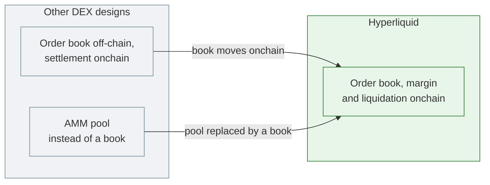
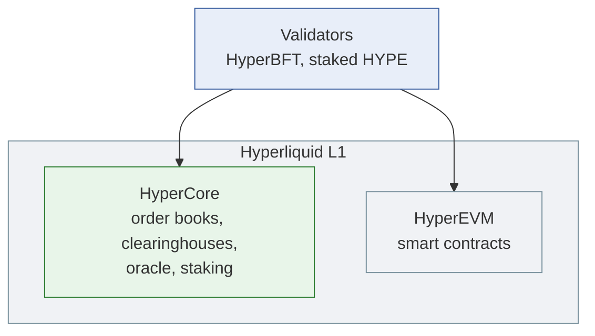
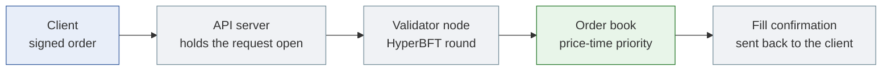
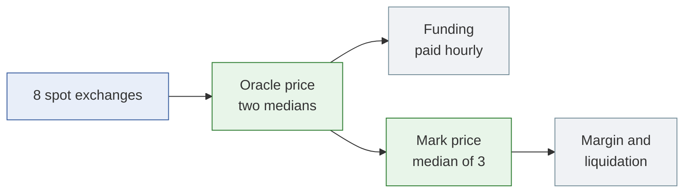
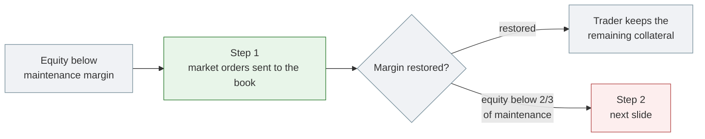
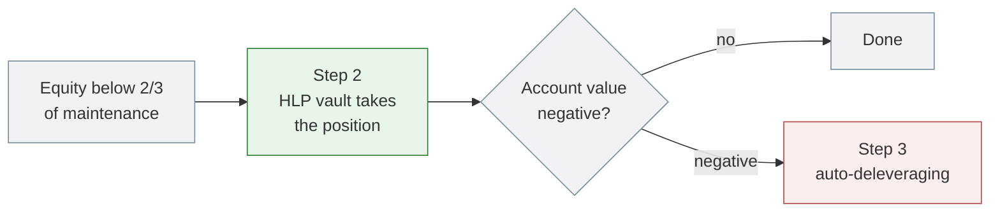
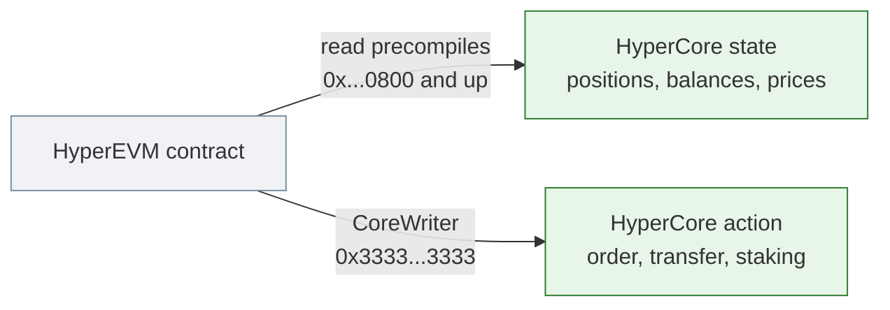
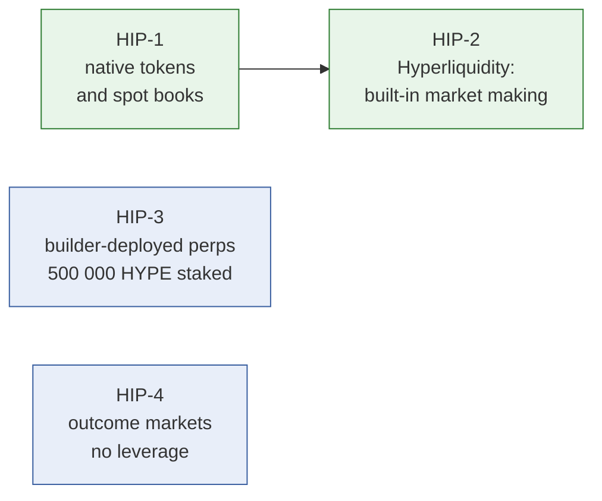
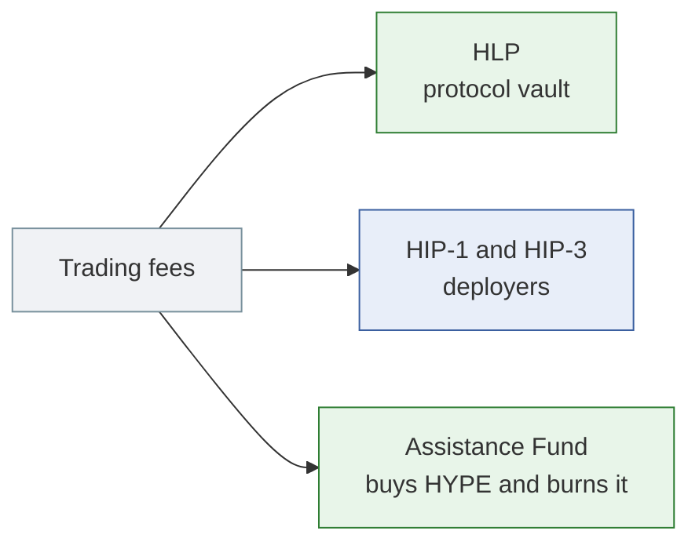
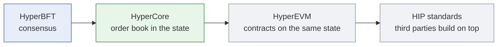

# Hyperliquid in Five Minutes

**An L1 where the order book is part of consensus**

Ryan Sauge · v1.0 · 2026-10-01

Talk length: about 5 minutes (11 slides, 20 to 35 seconds each)

Source: [The Hyperliquid Protocol - HyperCore, HyperEVM and Onchain Perpetual Mechanics](https://rya-sge.github.io/access-denied/2026/09/02/hyperliquid-protocol-architecture/) and the [Hyperliquid documentation](https://hyperliquid.gitbook.io/hyperliquid-docs)

---

## 1. What is Hyperliquid

- A decentralised exchange for perpetual futures and spot, running on its own proof-of-stake chain.
- Many DEXs keep the order book off-chain, or replace it with an AMM. Hyperliquid puts the order book, margin and liquidations into the chain state that validators agree on.
- The question for this talk: what does an exchange look like when it is the chain itself?

> **Speaker notes (25 s):** Most people know Hyperliquid as a perp exchange. The design choice behind it is that the matching engine is not an app deployed on a chain. Every validator runs it.

---

## 2. Architecture: one consensus, two execution states

- **HyperBFT**: a HotStuff variant. A block is committed when validators holding more than two thirds of the staked HYPE sign it.
- **HyperCore**: order books, perp and spot clearinghouses, the oracle, staking.
- **HyperEVM**: a regular EVM (chain ID 999). Same consensus, same history, no bridge to HyperCore.

> **Speaker notes (30 s):** For a co-located client, the median time from sending an order to a committed answer is 0.2 seconds. Mainnet handles about 200 000 orders per second, and the documentation says execution is the bottleneck, not consensus.

---

## 3. The life of an order

Inside a block, actions run in three groups:

1. Orders that take no liquidity (post-only)
2. Cancels
3. Orders that take liquidity (GTC, IOC)

> **Speaker notes (35 s):** A market maker who cancels and a trader who hits the same quote in the same block: the cancel wins. That removes a form of front-running that a first-come, first-served block allows. Margin is checked when the order is placed, and again for the resting order at each match, because the price may have moved between the two.

---

## 4. Prices: oracle and mark

- **Oracle price**: every ~3 s, each validator takes a weighted median of 8 spot exchanges; the chain takes the stake-weighted median of the validators. Used for funding.
- **Mark price**: median of three indices (oracle + basis, local book, external perps). Used for margin and liquidation.

> **Speaker notes (30 s):** One consequence: a position can be liquidated with no trade on Hyperliquid at that price, because the mark price also reads external markets. The oracle has its own deck if someone wants the details.

---

## 5. Liquidation: on the order book

- Anyone can take the other side of the liquidation orders.
- Positions above 100 000 USDC: 20% at a time, then a 30-second cooldown.

> **Speaker notes (20 s):** Maintenance margin is half the initial margin at maximum leverage, so between 1.25% and 16.7% depending on the asset. Most liquidations end at this step.

---

## 6. Liquidation: backstop and auto-deleveraging

- Auto-deleveraging closes the most profitable and most levered opposite positions first.
- A user with no open position never pays for platform losses.

> **Speaker notes (20 s):** The trader does not get the maintenance margin back at step 2: HLP keeps it so that backstop liquidations are profitable on average.

---

## 7. HyperEVM and HyperCore

- **Read**: values match HyperCore at the moment the EVM block was built.
- **Write**: orders sent through CoreWriter are delayed by a few seconds, so the EVM cannot be used to jump ahead of the L1 queue.
- Two block types: small blocks every second (3M gas), big blocks every minute (30M gas).

> **Speaker notes (30 s):** This is how a lending protocol or a vault on the HyperEVM can trade on the order book and price its collateral with the same number the clearinghouse uses.

---

## 8. The HIP standards

| Standard | What it adds |
|---|---|
| HIP-1 | Anyone can deploy a token and its spot market (Dutch auction, 500 HYPE floor) |
| HIP-2 | An onchain strategy that keeps a 0.3% spread, refreshed every 3 s |
| HIP-3 | Anyone can run a perp exchange; the deployer publishes the oracle and can be slashed |
| HIP-4 | Fully collateralised markets with a fixed settlement range, e.g. prediction markets |

> **Speaker notes (30 s):** Green: spot tokens and their liquidity. Blue: new market types, perps and outcomes. HIP-2 attaches to a HIP-1 token at deployment, which is why those two are linked.

---

## 9. Where the fees go

- Base perp fees: 0.045% taker, 0.015% maker. Staking HYPE gives up to 40% off.
- No operator takes a cut. HLP also runs the backstop liquidations.
- Staking: rewards of about 2.37% per year at 400M HYPE staked.

> **Speaker notes (25 s):** HLP is the vault from slide 6. Anyone can deposit into it, with a four-day lock-up after each deposit.

---

## 10. Limitations

| Limitation (by design) | What it means for a user |
|---|---|
| Validators with two thirds of the stake can change any state | The order book, the oracle and every validator vote share one trust assumption |
| Validator votes decide offchain questions | Delistings, HIP-3 slashing and quote-asset status are judgement calls by stake |
| HIP-3 oracle is one deployer | Slashed stake is burned; users are not compensated |
| HyperEVM token links are not verified | A linked contract can hold arbitrary code; integrators must check it |
| No automatic slashing of validators | Misbehaving validators can be jailed by vote, not slashed |

> **Speaker notes (30 s):** None of this is hidden; the documentation states each point. The trust model reduces to how HYPE stake is distributed across validators.

---

## 11. Conclusion

- On Hyperliquid, the exchange is the chain's state machine.
- That lets the chain order cancels before takers, check margin at each match, and close losses through a fixed liquidation sequence.
- The cost is one trust assumption for everything: two thirds of the staked HYPE.

> **Speaker notes (25 s):** Back to the opening question. An exchange that is the chain gets a central-exchange order book with onchain settlement, and puts all its trust in the validator set.
